# FastLanes in cuDF: integration report (2026-09-27)

This report describes how the FastLanes bit-packing encodings are wired into cuDF's Parquet writer
and reader on branch `fastlane-working`, and what had to change to bring the branch up to the
cuDF 26.10 release branch. Benchmark results on TPC-H SF100 are in
[FASTLANES_TPCH_SF100_BENCHMARK_2026-09-27.md](FASTLANES_TPCH_SF100_BENCHMARK_2026-09-27.md). It
supersedes [FASTLANES_INTEGRATION_REPORT_2026-03-28.md](FASTLANES_INTEGRATION_REPORT_2026-03-28.md),
which describes the earlier split-32 layout for INT64 (now the deprecated
`FASTLANE_BITPACK_SPLIT64`).

## 1. Summary

- **What FastLanes adds.** Three Parquet page encodings (on-disk IDs 10-12). A column opts in
  through the normal per-column encoding request: `FASTLANES_DELTA_BINARY` for INT64 columns
  (packed on the GPU) and `FASTLANE_BITPACK_RAW` for INT32 and date columns (packed on the CPU).
  `FASTLANE_BITPACK_SPLIT64` is deprecated and only decoded. Reading needs no options, but other
  Parquet readers cannot read these pages.
- **Where it lives.** Entirely inside the Parquet module: type checks in `writer_impl.cu`,
  encoding selection and page sizing in `page_enc.cu`, a staging step in `EncodePages` that builds
  each FastLanes page payload, and one-warp-per-page decode kernels selected in `page_hdr.cu` and
  launched from `reader_impl.cpp`. Compression, statistics, page headers and file assembly are
  unchanged cuDF code.
- **The 26.10 merge.** `fastlane-working` now sits on `release/26.10` through a merge commit with
  four conflict resolutions (`c8533b8d3d`) and a port to the 26.10 APIs (`9ed93250d2`:
  `cuda::stream_ref`, the composed decode state, `cuda::` functors), followed by the benchmark
  tooling (`e0f905a0ae`) and these reports. The previous state is kept as
  `backup/fastlane-working-pre-26.10`.
- **Validation.** In the 26.10 devcontainer on an RTX 5090 Laptop GPU, all 713 tests in the six
  Parquet test targets pass (one skipped upstream), including the 50 FastLanes tests, and the
  FastLanes example programs pass. The TPC-H SF100 benchmark decoded every FastLanes file back to
  the source values. That benchmark is also the only end-to-end check of the INT64 path: no gtest
  writes an INT64 column with FastLanes (section 4).
- **Main limits.** Flat columns without nulls only, slow writes (about 1 GB/s), non-standard
  encoding IDs, and a frame-of-reference code that loses badly on sorted keys. Used selectively,
  FastLanes makes the TPC-H SF100 files 1.1% (SNAPPY) and 0.6% (ZSTD) smaller.

## 2. How FastLanes plugs into cuDF

FastLanes is added as three extra Parquet page encodings. Nothing outside the Parquet module
changes: a column opts in through the existing per-column encoding request, the writer produces
ordinary Parquet pages whose value section holds a FastLanes payload, and the reader recognizes
the new encoding IDs and decodes those pages with dedicated kernels.

```mermaid
flowchart LR
  subgraph writePath [Write path]
    SetEnc["column_in_metadata.set_encoding"] --> SchemaCheck["writer_impl.cu: schema validation"]
    SchemaCheck --> MaskSel["page_enc.cu: data_encoding_for_col"]
    MaskSel --> Reserve["InitEncoderPages: page size reservation"]
    Reserve --> EncDispatch["EncodePages: one stream per encoding"]
    EncDispatch --> Stage["fastlanes_encode_stage: gather, encode, validate"]
    Stage --> CopyK["gpuEncodeCpuPages + finish_page_encode"]
  end
  subgraph readPath [Read path]
    PageHdr["page_hdr.cu: kernel_mask_for_page"] --> Dispatch["reader_impl.cpp: decode_page_data"]
    Dispatch --> DecK["page_fastlanes_decode.cu: one warp per page"]
  end
  CopyK --> PqPage["Parquet page: 128-byte FastLanes header + 1024-value vectors"]
  PqPage --> PageHdr
```



### 2.1 Public surface

| Item | Where | Values |
| --- | --- | --- |
| Encoding request | `cudf::io::column_encoding` in `cpp/include/cudf/io/types.hpp` | `FASTLANE_BITPACK_RAW`, `FASTLANES_DELTA_BINARY`, `FASTLANE_BITPACK_SPLIT64` (deprecated) |
| On-disk encoding ID | `cudf::io::parquet::Encoding` in `cpp/include/cudf/io/parquet_schema.hpp` | 10, 11, 12 (`NUM_ENCODINGS` moves to 13) |

A column opts in the same way as for any other encoding:

```cpp
cudf::io::table_input_metadata metadata(table);
metadata.column_metadata[0].set_encoding(cudf::io::column_encoding::FASTLANES_DELTA_BINARY);  // INT64
metadata.column_metadata[1].set_encoding(cudf::io::column_encoding::FASTLANE_BITPACK_RAW);    // INT32 / date
```

Reading needs no options: `cudf::io::read_parquet` recognizes encodings 10-12. Other Parquet readers
do not know these IDs (pyarrow reports them as `UNKNOWN`), so FastLanes files are cuDF-only.

Eligibility, enforced when the schema is built in `writer_impl.cu` and again on the device in
`data_encoding_for_col`:

| Encoding | Physical type | Logical types | Encoded on |
| --- | --- | --- | --- |
| `FASTLANE_BITPACK_RAW` | INT32 | int8/16/32, uint8/16/32, date32, decimal32, durations | CPU |
| `FASTLANES_DELTA_BINARY` | INT64 | int64, uint64 (no decimal, timestamp or time annotation) | GPU |
| `FASTLANE_BITPACK_SPLIT64` | INT64 | refused at write time (`CUDF_FAIL`); still decodable | - |

Ineligible requests log a warning and fall back to the default encoding; nested (list) columns
fall back on the device side (`RAW` to PLAIN, `DELTA_BINARY` to DELTA_BINARY_PACKED).

### 2.2 Write path

1. **Schema validation** (`construct_parquet_schema_tree` in `writer_impl.cu`): checks the physical
   and logical type of each FastLanes request against the table above.
2. **Kernel-mask selection** (`data_encoding_for_col` in `page_enc.cu`, device code): maps the
   request to `encode_kernel_mask::FASTLANE_BITPACK_RAW` (bit 6) or `FASTLANES_DELTA_BINARY`
   (bit 7) after a runtime check that the column is flat.
3. **Page sizing** (`InitEncoderPages`): FastLanes pads every page to whole 1024-value vectors, so
   the page buffer reserves the worst case: 128-byte header + `ceil(n / 1024) * 1024` values at
   32 bits (RAW) or 64 bits (NATIVE64), plus the level bytes that precede the payload.
4. **Dispatch** (`EncodePages`): each active encoding bit gets its own forked stream, as for the
   standard encodings. FastLanes bits call `fastlanes_encode_stage::run_fastlanes_raw32_encode` or
   `run_fastlanes_native64_encode` (`fastlanes_page_encoder_*.cuh`). These headers are
   source-included into `page_enc.cu` so they can launch its templated kernels.
5. **Staging** (per FastLanes category):
   - copy the `EncPage` array to the host and pick the pages of that category;
   - `gpuGatherSinglePageTyped` gathers each page's values into a contiguous buffer, applying the
     same type conversions as the PLAIN path (int8/16 promotion, timestamp scaling);
   - encode: RAW32 downloads each page, subtracts the page minimum and packs 1024-value vectors
     with the generated FastLanes `pack` kernels on the CPU, then uploads the blob. NATIVE64 does
     the minimum reduction and packing on the GPU with per-bit-width kernels
     (`native64_cuda_kernels.inl`);
   - read back every page header in one batch (one sync per category), validate it, and check the
     blob fits the reservation.
6. **Page assembly**: `gpuEncodePageLevels` writes definition/repetition levels,
   `gpuEncodeCpuPages` copies the FastLanes blob into the page, sets `page.encoding` to 10 or 11,
   and calls the stock `finish_page_encode` for the page header, statistics and compression input.
   Compression, column-chunk metadata (including `encoding_stats`) and file assembly are unchanged
   cuDF code.

### 2.3 On-disk page format

A FastLanes page is a normal Parquet data page (V1 or V2 header, standard RLE levels). Its value
section is a 128-byte FastLanes header followed by the packed payload:

| Offset | Size | Field | Meaning |
| --- | --- | --- | --- |
| 0 | 1 | `bitwidth_lo` | bits per value (RAW32, NATIVE64) or low component (SPLIT64) |
| 1 | 1 | `bitwidth_hi` | high-component bits (SPLIT64 only) |
| 2 | 1 | `pre_delta` | layout policy flag, validated per encoding |
| 3 | 1 | `reserved_flags` | must be 0 |
| 4 | 4 | `original_count` | values in the page |
| 8 | 4 | `padded_count` | `original_count` rounded up to a multiple of 1024 |
| 12 | 4 | `body_size` | payload bytes |
| 16 | 4 | `min_value_lo` | page minimum (low 32 bits) |
| 20 | 4 | `min_value_hi` | page minimum (high 32 bits) |
| 24 | 104 | padding | zeros |
| 128 | `body_size` | payload | `padded_count / 1024` vectors, each `1024 * bitwidth / 8` bytes |

Both active encodings are **frame-of-reference** codes: every value is stored as
`value - page_minimum` in a fixed number of bits chosen per page, laid out in the FastLanes
interleaved 1024-value vector order. Despite its name, `FASTLANES_DELTA_BINARY` does not take
differences between consecutive values (its `pre_delta` policy is off and the kernels pack
`value - base`). This matters for sorted keys; see the benchmark report.

### 2.4 Read path

1. **Kernel selection** (`kernel_mask_for_page` in `page_hdr.cu`): encodings 10/11/12 map to
   `decode_kernel_mask` bits 27/28/29; `is_supported_encoding` in `parquet_gpu.hpp` accepts them.
2. **Dispatch** (`decode_page_data` in `reader_impl.cpp`): counts the active kernels, forks one
   stream per kernel, and launches `decode_fastlanes_raw32` / `_split64` / `_native64`.
3. **Decode** (`page_fastlanes_decode.cu`): one warp (32 threads) per page.
   - Pruned pages return immediately; the host side fixes their null masks and offsets.
   - `setup_local_page_info` performs cuDF's common page setup (level decoding, row ranges,
     output pointers) into a `full_page_decode_state`.
   - The page is validated: flat column, no nulls in the page, supported output width, and a
     header that matches the encoding.
   - For each 1024-value vector the packed words are staged through shared memory (payloads may
     be unaligned), unpacked (generated `unpack_device` for 32-bit, per-bit-width native64 decode
     for 64-bit), rebased by the page minimum, and written straight into the output column at the
     page's row offset, honoring `skip_rows` / `num_rows`.

### 2.5 Code map

| Layer | Files | Lines | Role |
| --- | --- | ---: | --- |
| Public enums | `cpp/include/cudf/io/types.hpp`, `parquet_schema.hpp` | ~20 | encoding request and on-disk IDs |
| FastLanes core headers | `cpp/include/cudf/fastlanes/` | 5,738 | page header, sizing helpers, generated device unpack, NATIVE64 kernels, encoder API |
| Generated CPU kernels | `cpp/src/fastlanes/{pack,unpack,ffor,unffor,transpose,unrsum}.cpp` + wrappers | 109,723 | FastLanes reference kernels (generated code) |
| Encoders | `cpp/src/fastlanes/encode_*.cu`, `encode_common.hpp`, `native64_host.cu` | 759 | RAW32 (CPU), NATIVE64 (GPU), SPLIT64 (legacy) |
| Parquet glue | `cpp/src/io/parquet/fastlanes_*`, `page_fastlanes_decode.cu` | 1,287 | eligibility helpers, encode staging, decode kernels |
| Parquet hooks | `writer_impl.cu`, `page_enc.cu`, `page_hdr.cu`, `reader_impl.cpp`, `parquet_gpu.hpp`, `reader_impl_preprocess_utils.cu` | ~500 changed | validation, sizing, dispatch |
| Tests | `cpp/tests/io/parquet_fastlanes_*` | 2,865 | `PARQUET_FASTLANES_TEST` (50 test definitions) |
| Tools | `cpp/examples/parquet_io/` | - | `parquet_io_chunk`, `fastlanes_encoding_bench`, sanity programs, search and roundtrip scripts |

Build wiring: `cpp/CMakeLists.txt` adds the 13 FastLanes sources and `page_fastlanes_decode.cu` to
the `cudf` library; `cpp/tests/CMakeLists.txt` defines `PARQUET_FASTLANES_TEST`.

## 3. What the 26.10 merge changed

### 3.1 Git operations

- The worktree `/home/qic/cudf-fastlane-isolated` holds `fastlane-working` (a strict superset of
  `fastlane-isolated`: the same FastLanes files plus four newer commits). Its admin directory had
  been pruned from the main checkout, so it was re-registered with
  `git worktree add --no-checkout` + `git worktree repair` + `git reset` (no files touched).
- Backup of the pre-merge state: branch `backup/fastlane-working-pre-26.10` at `0fae90d66c`.
- `git merge --no-ff upstream/release/26.10` (upstream `eaa1e31058`, 945 commits ahead of the
  branch's merge base `3cfe15b68d`), committed as `c8533b8d3d`. The 26.10 API migration is a
  separate commit on top so the merge itself only contains conflict resolutions.

### 3.2 Conflict resolutions

| File | Conflict | Resolution |
| --- | --- | --- |
| `cpp/CMakeLists.txt` | upstream added `cudf_cuda_embed` / `cudf_fragments` include dirs where the branch added `src/io/parquet/fastlanes` | keep upstream's lines; drop the branch's include dir (that directory does not exist) |
| `cpp/src/io/parquet/parquet_gpu.hpp` | upstream took `decode_kernel_mask` bit 26 for `DICT_INT32`, which FastLanes also used | keep `DICT_INT32 = 1 << 26`; move FastLanes RAW / DELTA_BINARY / SPLIT64 to bits 27 / 28 / 29 |
| `cpp/src/io/parquet/page_enc.cu` | upstream rewrote page sizing (`lvl_size`, `MAX_PARQUET_PAGE_SIZE`, `PAGE_SIZE_OVERFLOW` error) | take upstream's sizing and apply the FastLanes worst-case reservation on top; the FastLanes bound now also counts `rle_pad + lvl_size` because level bytes precede the payload |
| `cpp/examples/parquet_io/README.md` | both sides added the file | upstream's example docs first, then the FastLanes tooling guide |

The other 11 files touched by both sides (`writer_impl.cu`, `reader_impl.cpp`, `page_hdr.cu`,
`types.hpp`, `parquet_schema.hpp`, the test CMake file, ...) merged cleanly; the `Encoding`,
`column_encoding` and `encode_kernel_mask` values FastLanes adds are still unused upstream.

### 3.3 API migrations required by 26.10

| Change in 26.10 | Effect on FastLanes | Fix |
| --- | --- | --- |
| `rmm::cuda_stream_view` is `[[deprecated]]`; cuDF builds with `-Werror` and has moved to `cuda::stream_ref` (`fork_streams`, `get_default_stream`) | every FastLanes stream parameter failed to compile | 16 files ported to `cuda::stream_ref` (`.value()` becomes `.get()`), including the encoder API, staging headers, decode launchers, tests and examples |
| `page_state_s` was split into composed states (`full_page_decode_state` with `setup` / `stream` / `nesting` / `output_cvt`); `update_list_offsets_for_pruned_pages` was removed and pruned pages are now handled on the host | the FastLanes decode kernels no longer compiled | kernels use `full_page_decode_state` with the field remap; pruned pages exit before setup like every upstream decoder |
| cuDF uses `cuda::minimum` / `cuda::maximum` / `cuda::std::logical_or` instead of the Thrust functors | NATIVE64 reductions | switched to the `cuda::` functors |
| GCC 14 treats use of a `[[deprecated]]` enumerator as an error, and `nv_diag_suppress` does not reach the host compiler | the SPLIT64 refusal `case` in `writer_impl.cu` | added `#pragma GCC diagnostic` push/ignore/pop around the case label |

Kernel launches in the FastLanes paths now check `cudaGetLastError()` and the staging copies use
`CUDF_CUDA_TRY`, matching upstream's `EncodePages`.

## 4. Validation

Environment: the RAPIDS 26.10 `cuda13.3-conda` devcontainer (CUDA 13.3.73, GCC 14.4, nvCOMP
5.3.0.16) on an RTX 5090 Laptop GPU (sm_120). libcudf and its tests were built in Release for the
native architecture with `configure-cudf-cpp` and `build-cudf-cpp`, and the tests were run with
`test-cudf-cpp`. The examples were built against that build with `cpp/examples/build.sh`.

| Test target | Tests | Result |
| --- | ---: | --- |
| `PARQUET_FASTLANES_TEST` | 50 | all pass |
| `PARQUET_TEST` | 551 | 550 pass; 1 skipped by upstream (`ZeroColumnsPreservesRowCount`, [cudf#22935](https://github.com/NVIDIA/cudf/issues/22935)); 4 upstream tests are disabled |
| `HYBRID_SCAN_TEST` | 101 | all pass |
| `PARQUET_DELETION_VECTORS_TEST` | 6 | all pass |
| `STREAM_IO_PARQUET_TEST` | 4 | all pass |
| `STREAM_IO_HYBRID_SCAN_TEST` | 1 | all pass |

`PARQUET_TEST`, `HYBRID_SCAN_TEST` and the deletion-vector tests exercise the reader's decode
dispatch, where the FastLanes kernel-mask bits were renumbered. The `STREAM_IO_*` targets check
that the Parquet paths run on the caller's stream.

What `PARQUET_FASTLANES_TEST` covers:

- `ParquetCpuEncoderTest` (40 tests): Parquet write/read round trips with `FASTLANE_BITPACK_RAW`
  for every eligible INT32 logical type (int8/16/32, uint8/16/32, date32, decimal32, durations),
  1024-value padding boundaries, multi-page columns with different bit widths, header metadata,
  SPLIT64 decoding, and fallbacks for unsupported types.
- `ParquetFastLanesNative64GeneratedTest` and `ParquetFastLanesNative64Bw37Test` (5 tests each):
  the NATIVE64 GPU encoder against a CPU reference across bit widths, including randomized and
  adversarial inputs at the 37-bit boundary. These tests call the encoder directly; they do not go
  through the Parquet writer or reader.

Example programs in `cpp/examples/parquet_io` (all pass): `fastlane_one_page_sanity_test` (INT32
and UINT32, sequential and random, one page each, bit-exact against the reference `pack()`),
`fastlane_multi_page_sanity_test` (one UINT32 multi-page case), `fastlane_multi_column_test`
(INT32/UINT32 columns with sequential and random data), `fastlane_encode_verify_test` and
`fastlane_int64_cpu_roundtrip` (the CPU reference kernels), and `parquet_io_chunking_sanity`
(chunked rewrite of the SF100 `supplier` table). The 64-bit cases of the first three programs are
commented out: they predate NATIVE64 and request SPLIT64.

End to end: the TPC-H SF100 benchmark wrote 69 single-column files with FastLanes (12 INT64 and
11 INT32 columns, three codecs) and 22 full-table files that use FastLanes, and every one decoded
back to the source values.

**Coverage gaps.** No gtest writes or reads an INT64 column with `FASTLANES_DELTA_BINARY`, so the
NATIVE64 Parquet path, including the decode kernel ported in this merge, is verified only by the
benchmark above. No test reads FastLanes pages with `skip_rows`/`num_rows`, page pruning, the
chunked reader or nullable columns.

## 5. Limitations and follow-ups

- **Non-standard encoding IDs.** Values 10-12 are not part of the Parquet specification and could
  collide with future spec encodings; files that use them are readable only by this cuDF branch.
- **Flat, non-null pages only.** The decoder rejects pages that contain nulls or nesting. The write
  path checks for nesting but not for nulls, and no test covers nullable data with actual nulls,
  so a column with nulls should not be written with FastLanes today (found by code reading, not
  exercised).
- **Missing tests.** Add Parquet round-trip tests for `FASTLANES_DELTA_BINARY` (multi-page, tail
  pages, wide bit widths) and for reading FastLanes pages with row ranges, page pruning and the
  chunked reader (section 4).
- **Slow writes.** RAW32 encodes on the CPU: each page is downloaded, packed on the host and
  uploaded again, with a stream sync per page. NATIVE64 encodes on the GPU but still runs per-page
  reductions and allocations. On TPC-H SF100 FastLanes writes at about 1 GB/s against 6-12 GB/s
  for DELTA_BINARY_PACKED, and 5,000-row pages cut that by another 40-60%.
- **Frame-of-reference, one bit width per page.** Sorted or clustered keys, where consecutive
  deltas are tiny, compress far better with DELTA_BINARY_PACKED's per-miniblock bit widths (13-17
  bits per value against 0.03-5 on the TPC-H keys). The generated FastLanes code already contains
  the transpose and running-sum (`unrsum`) kernels used for FastLanes' delta coding, but the
  active encoders do not use them.
- **Constant pages cost 1 bit per value.** `compute_bitwidth` in `encode_common.hpp` never returns
  0, so a constant column (TPC-H `o_shippriority`) costs 1.07 bits per value against 0.02 for
  DICTIONARY.
- **Page padding.** Every page is padded to whole 1024-value vectors. cuDF builds pages from whole
  page fragments (5000 rows by default for fixed-width columns), so by default pages hold 5000 or
  20000 rows and FastLanes pays about 2.4% padding; setting `max_page_fragment_size` to a
  multiple of 1024 removes it (quantified in the benchmark report).
- **Decimals are not eligible.** DECIMAL64 columns (common in TPC-H) cannot use FastLanes.
- **SPLIT64 is deprecated.** It is refused at write time because of a sub-vector page-padding bug;
  decoding is kept for existing files.
- **Conservative reservation.** Page buffers reserve 32 or 64 bits per value, larger than the
  encoded size, which raises peak writer memory.
