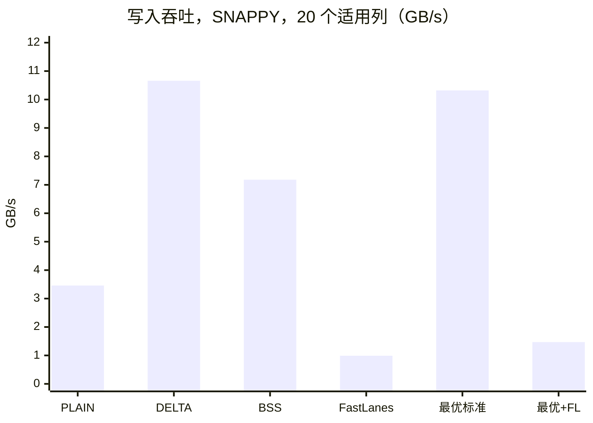
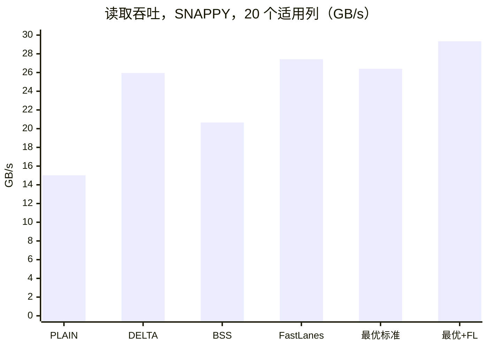

# FastLanes 与标准 Parquet 编码在 TPC-H SF100 上的对比（2026-09-27）

本文在完整的 TPC-H SF100 数据集上测 FastLanes 在 cuDF Parquet 读写中的实际效果：文件大小、写入速度和读取
速度，并和 cuDF 对同一列支持的所有标准 Parquet 编码做对比。FastLanes 怎样接入 cuDF 见
[FASTLANES_INTEGRATION_REPORT_2026-09-27.md](FASTLANES_INTEGRATION_REPORT_2026-09-27.md)。对应的 Cursor
Canvas 源文件在 `canvas/fastlanes-tpch-sf100-benchmark.canvas.tsx`。

## 1. 结论

- 23 个适用列里，FastLanes 在不压缩时有 9 列最小，SNAPPY 下 8 列，ZSTD 下 5 列。这些列的值在每个 page
  内分散在一个范围里：未排序的外键（`l_partkey`、`l_suppkey`、`o_custkey`）、数量（`ps_availqty`）和日期。
  在这些列上，它比最优标准编码小 2-7%（ZSTD 下 0-6%）。
- 在有序 key、低基数列和小表上，它要大得多。两种 FastLanes 编码器都按 page 存 `value - page 最小值`，
  每个 page 一个 bit 宽度，所以有序 key 每值要 13-17 bit，DELTA_BINARY_PACKED 只要 0.03-5 bit。所有适用列
  都用 FastLanes 的话，文件比用最优标准编码大 3-4%。
- 整个文件在 SNAPPY 下小 1.1%，ZSTD 下小 0.6%。只在 FastLanes 最小的列上用它，8 张表从 27.71 GB 降到
  27.39 GB（SNAPPY），从 22.37 GB 降到 22.23 GB（ZSTD）。收益被摊薄，是因为适用列只占文件字节的 28-32%，
  其余是字符串和 decimal。选对标准编码的影响更大：光这一步就比 cuDF 的默认编码小 4-5%。
- 写入慢 7-12 倍，读取略快。FastLanes 编码约 1 GB/s，DELTA_BINARY_PACKED 是 6-12 GB/s；INT32 编码器在
  CPU 上打包，只有 0.7 GB/s。解码 22-27 GB/s，比 DELTA_BINARY_PACKED 快 3-19%。8 张表整体重写从 56 s 变成
  76 s（SNAPPY），读回从 5.62 s 变成 5.39 s。
- Page 对齐的影响不大：page 正好 20,480 行（20 个完整的 FastLanes vector）时，FastLanes 比 cuDF 默认的
  20,000 行 page 在不压缩时小 2.3%，压缩后最多小 0.8%。两种布局下胜出的列相同，只有两处原本就接近打平的结果
  翻转了。
- 所有结果都做了校验：345 个单列结果和 22 个用到 FastLanes 的整表文件，解码后都和源数据一致。

## 2. 测试环境

| 项 | 内容 |
| --- | --- |
| GPU | NVIDIA GeForce RTX 5090 Laptop GPU，24 GB，compute capability 12.0，驱动 595.84 |
| 主机 | Intel Core Ultra 9 275HX（24 核），62 GB 内存，NVMe SSD |
| 软件 | RAPIDS 26.10 devcontainer（cuda13.3-conda），CUDA 13.3.73，GCC 14.4，nvCOMP 5.3.0.16 |
| cuDF | `fastlane-working` 分支：FastLanes 基于 `release/26.10`，库对应 `9ed93250d2`，工具对应 `e0f905a0ae`；Release 构建，sm_120 |
| 数据 | TPC-H SF100 全部 8 张表（61 列，8.66 亿行）。`lineitem` 用现有的 `lineitem_sf100.parquet`；其余 7 张表用 `COPY <t> TO '<t>.parquet' (FORMAT parquet, COMPRESSION snappy)` 从现有的 DuckDB 数据库导出。全部是 DuckDB 的 122,880 行 row group |
| 工具 | `fastlanes_encoding_bench`（逐列测试、读取计时），`parquet_io_chunk`（整表重写），驱动脚本 `tools/bench/run_tpch_sf100_fastlanes_bench.py` |
| 原始结果 | `cpp/examples/parquet_io/artifacts/fastlanes_bench_sf100_20260927/`（在 gitignore 中）：`03_raw/*.csv` 和日志，`02_machine/summary.json`，`01_human/summary.md` |

### 2.1 FastLanes 能编码的列

TPC-H 的 61 列里有 23 列适用：

- 12 个 INT64 列用 `FASTLANES_DELTA_BINARY`（NATIVE64 编码器，GPU）：订单、零件、供应商和客户这几类 key
  共 10 列，外加 `l_linenumber` 和 `ps_availqty`。
- 11 个 INT32 列用 `FASTLANE_BITPACK_RAW`（RAW32 编码器，CPU）：4 个日期列和 7 个小整数列（`c_nationkey`、
  `s_nationkey`、`n_nationkey`、`n_regionkey`、`r_regionkey`、`o_shippriority`、`p_size`）。
- 其余 38 列是字符串（29 列）和 `DECIMAL(15,2)`（9 列），FastLanes 不支持。

按大小算，适用列占 SNAPPY 文件的 27.6%、ZSTD 文件的 31.8%（按最优标准编码计）。在这些列上省下的空间，放到整个
文件上要乘以这个比例。

### 2.2 测试方法

- 所有测试用同一种布局：Parquet V2 page header，122,880 行的 row group，20,480 行的 page，也就是每个 row
  group 正好 6 个 page，每个 page 正好 20 个完整的 FastLanes vector。cuDF 用完整的 page fragment 组 page 和
  row group（定长列默认 5,000 行一个 fragment），所以 writer 的 `max_page_fragment_size` 也设成 20,480；
  不设的话，同样的参数得到的是 20,000 行的 page 和 120,000 行的 row group。变化的只有编码和 codec。
- 逐列测试（穷举）：Parquet 的每个 column chunk 是独立编码的，所以单独测每一列就能得到每列的最优编码。
  这相当于 [ENCODING_SEARCH_METHOD.md](ENCODING_SEARCH_METHOD.md) 里贪心搜索的穷举版。23 列中的每一列，
  5 种编码（PLAIN、DICTIONARY、DELTA_BINARY_PACKED、BYTE_STREAM_SPLIT、FastLanes）× 3 种 codec（NONE、
  SNAPPY、ZSTD）都测一遍：
  - 每列只往 GPU 加载一次；
  - 写入 = cuDF chunked writer 从显存写到 host buffer（编码、压缩、device 到 host 的拷贝、footer）；
  - 读取 = 对这个 host buffer 每 256 个 row group 调一次 `read_parquet`（host 到 device 的拷贝、解压、
    解码）；
  - 预热 1 次，计时 3 次，取中位数。吞吐（GB/s）= 列在内存中的字节数（行数 × 类型宽度）/ 中位时间；
  - 每个结果都要检查：解码出的列必须和源数据一致，footer 里的 page 编码必须和请求的一致（被悄悄回退的会被
    标记并排除）。
- 整表方案：每张表用 `parquet_io_chunk` 按四种编码方案重写，SNAPPY 和 ZSTD 各一遍（NONE 已由逐列测试
  覆盖；不压缩的 `lineitem` 约 66 GB，瓶颈会落在 I/O 上）。FastLanes 不支持的列在所有方案里都用 cuDF 默认编码，
  所以各方案只在 23 个适用列上有区别：
  - `cudf-default`：所有列都用 cuDF 默认编码；
  - `best-standard`：每个适用列用逐列测试得到的最小标准编码；
  - `fastlanes-all`：所有适用列都用 FastLanes；
  - `best-with-fastlanes`：每个适用列用最小的编码，FastLanes 也参与比较。

  重写时间取 `parquet_io_chunk` 的处理时间：读源文件、编码、压缩和写入。用到 FastLanes 的方案之后还会逐个
  row group 和源数据比对（不计时）。每个输出文件再用分批的 `read_parquet`（每次 128 个 row group；预热 1 次，
  计时 3 次）在热缓存下读回。
- Page 布局对比：逐列测试还用 cuDF 默认的 fragment 跑了一遍（20,000 行 page，120,000 行 row group），
  这样 23 列在默认布局下也有同样的对比。另外，`l_partkey` 和 `l_shipdate` 在 SNAPPY 下测了三种布局：默认
  fragment 加 614 行的 page 上限（这是之前 `parquet_io_chunk` 在这些文件上用的设置；page 不能拆开 fragment，
  所以实际每个 page 是 5,000 行）、cuDF 默认布局、正好 20,480 行的 page。

## 3. 结果

### 3.1 逐列压缩效果

大小用每值 bit 数表示：column chunk 的文件字节数 × 8 / 行数。PLAIN 对 INT64 是 64.02 bit，对 INT32 和日期是
32.02 bit。"最优标准"是该 codec 下 PLAIN、DICTIONARY、DELTA_BINARY_PACKED、BYTE_STREAM_SPLIT 中最小的一个；
如果和不压缩时的最优编码不同，会在括号里注明。完整数据见附录 A。

**FastLanes 最小的列**（至少在一种 codec 下）：

| 列 | 类型 | 行数 | FastLanes，NONE | 最优标准，NONE | FastLanes 相对最优：NONE | SNAPPY | ZSTD |
|---|---|---:|---:|---|---:|---:|---:|
| `lineitem.l_partkey` | INT64 | 600M | 25.07 | DELTA 26.05 | **−3.7%** | **−3.7%** | **−1.7%**（BSS） |
| `lineitem.l_suppkey` | INT64 | 600M | 20.07 | DELTA 21.46 | **−6.5%** | **−6.5%** | **−5.9%** |
| `lineitem.l_shipdate` | 日期 | 600M | 12.07 | DELTA 12.47 | **−3.2%** | **−3.2%** | +6.2%（BSS） |
| `lineitem.l_commitdate` | 日期 | 600M | 12.07 | DELTA 12.47 | **−3.2%** | **−3.2%** | +8.5%（BSS） |
| `lineitem.l_receiptdate` | 日期 | 600M | 12.07 | DELTA 12.47 | **−3.2%** | **−3.2%** | +6.0%（BSS） |
| `orders.o_custkey` | INT64 | 150M | 24.07 | DELTA 25.52 | **−5.7%** | **−5.7%** | **−0.0%**（BSS） |
| `orders.o_orderdate` | 日期 | 150M | 12.07 | DICT 12.66 | **−4.7%** | **−4.7%** | **−2.9%** |
| `partsupp.ps_suppkey` | INT64 | 80M | 20.07 | DELTA 20.46 | **−1.9%** | +1,786% | +46,636% |
| `partsupp.ps_availqty` | INT64 | 80M | 14.07 | DELTA 15.09 | **−6.8%** | **−6.8%** | **−4.9%**（BSS） |

在这些列上，SNAPPY 完全压不动 FastLanes page，ZSTD 也只能再压 0.2-1.3%（`ps_suppkey` 上是 8.6%）；标准编码
留给 codec 的余地更大。`o_custkey` 在 ZSTD 下基本打平（24.03 对 24.04 bit）。`ps_suppkey` 是 TPC-H 生成器按
`ps_partkey` 算出来的，相邻差值按一个很短的规律重复：SNAPPY 和 ZSTD 能把 DELTA_BINARY_PACKED 的结果压到 1.06 和
0.04 bit，但在 FastLanes 打包后的值里看不出这个规律。

**标准编码始终更小的列**（每值 bit 数，NONE / SNAPPY / ZSTD）：

| 列 | 行数 | 特点 | FastLanes | 最优标准 | FastLanes 相对最优，SNAPPY |
|---|---:|---|---|---|---:|
| `lineitem.l_orderkey` | 600M | 有序，每个 key 1-7 行 | 15.07 / 9.16 / 5.55 | DELTA 5.05 / 2.66 / 1.85 | +244% |
| `orders.o_orderkey` | 150M | 有序 | 17.07 / 17.07 / 16.26 | DELTA 5.34 / 0.33 / 0.04 | +5,138% |
| `partsupp.ps_partkey` | 80M | 有序，每个 key 4 行 | 13.07 / 4.91 / 3.11 | DELTA 1.34 / 0.10 / 0.03 | +4,901% |
| `part.p_partkey` | 20M | 有序，连续 | 15.07 / 15.07 / 14.74 | DELTA 0.34 / 0.04 / 0.03 | +37,124% |
| `customer.c_custkey` | 15M | 有序，连续 | 15.07 / 15.07 / 14.74 | DELTA 0.34 / 0.04 / 0.03 | +37,091% |
| `supplier.s_suppkey` | 1M | 有序，连续 | 15.08 / 15.07 / 14.74 | DELTA 0.34 / 0.04 / 0.03 | +36,484% |
| `lineitem.l_linenumber` | 600M | 7 个取值 | 3.07 / 3.05 / 2.80 | DICT 3.04 / 2.21 / 1.48 | +38% |
| `orders.o_shippriority` | 150M | 常量 | 1.07 / 0.07 / 0.03 | DICT 0.02 / 0.02 / 0.02 | +243% |
| `part.p_size` | 20M | 50 个取值 | 6.07 / 6.07 / 5.98 | DICT 6.05 / DICT 6.05 / BSS 5.78 | +0.3% |
| `customer.c_nationkey` | 15M | 25 个取值 | 5.07 / 5.07 / 4.98 | DICT 5.04 / DICT 5.04 / BSS 4.81 | +0.4% |
| `supplier.s_nationkey` | 1M | 25 个取值 | 5.07 / 5.07 / 4.98 | DICT 5.05 / DICT 5.05 / BSS 4.81 | +0.4% |
| `nation.n_nationkey` | 25 | 小表 | 304 / 104 / 99 | DELTA 60 / 60 / 60 | +74% |
| `nation.n_regionkey` | 25 | 小表 | 222 / 87 / 83 | DELTA 64 / 64 / 64 | +36% |
| `region.r_regionkey` | 5 | 小表 | 1,112 / 376 / 365 | DELTA 299 / 299 / 299 | +26% |

### 3.2 FastLanes 为什么赢或输

- 对未排序的值，FOR 比差分好。目前两种 FastLanes 编码器都按 page 存 `value - page 最小值`，每个 page 一个
  bit 宽度（见集成报告 2.3 节），所以每个值大约需要 log2(max - min + 1) bit（向上取整）。DELTA_BINARY_PACKED
  存的是相邻值之差；数据没排序时，差值的范围是值范围的两倍，大约每值多 1 bit（每个 miniblock 的最小值能省回
  一点）。FastLanes 的优势就是这 1 bit：`l_partkey` 的取值范围是 2000 万（25 bit），FastLanes 每值 25.07 bit，
  DELTA 是 26.05；日期大约跨 2,500 天（12 bit），FastLanes 12.07 bit，DELTA 12.47。
- 有序 key 正好相反：相邻值只差 0 到几个单位，DELTA_BINARY_PACKED 只需 0.3-5 bit，剩下的大部分还能被
  codec 压掉；FOR 仍然要覆盖整个 page 的范围，比如一个 20,480 行的 `o_orderkey` page 大约跨 82,000 个 key 值
  （17 bit）。`cpp/src/fastlanes/` 里生成的 FastLanes 代码已经包含 FastLanes 做真正 delta 编码用的 transpose
  和前缀和（`unrsum`）kernel，但现在的编码器没有用（`pre_delta` 是关的）。
- 低基数列不压缩时打平，压缩后吃亏。`l_linenumber`（1-7）、`p_size`（1-50）和 nation key（0-24）需要的
  bit 数和字典索引一样，所以不压缩时 FastLanes 和 DICTIONARY 差不到 1%。用 SNAPPY 或 ZSTD 时，字典索引和按字节
  拆分后的数据里还有冗余可以被 codec 去掉，FastLanes 打包后的 word 里几乎没有。常量列每值也要 1 bit，因为编码器
  从不选 0 bit（`cpp/src/fastlanes/encode_common.hpp` 中的 `compute_bitwidth`）：`o_shippriority` 用
  FastLanes 是 1.07 bit，DICTIONARY 只要 0.02 bit。
- ZSTD 下，日期和小整数的最优编码换成了 BYTE_STREAM_SPLIT。按字节拆成几个平面后，ZSTD 可以对几乎不变的
  高位字节做熵编码，结果能低于固定的 bit 宽度：日期能到 10.98-11.25 bit，FastLanes 是 11.91-11.93。
- 小表吃固定开销：每个 FastLanes page 带 128 字节 header，并补齐到 1,024 个值，所以 25 行的 `nation` 和
  5 行的 `region` 的列要大 22-409%。

### 3.3 适用列汇总

对 20 个至少 100 万行的适用列求和（不含很小的 `nation` 和 `region` 列）。DICTIONARY 没有作为固定选项列出来，
因为其中 8 列上 cuDF 把它换成了 DELTA_BINARY_PACKED（见 3.7 节）；按列挑选时，它在哪列最小就会被选上。

| 编码 | NONE：GB（每值 bit） | SNAPPY | ZSTD |
|---|---:|---:|---:|
| PLAIN | 32.37 (50.65) | 16.25 (25.43) | 9.15 (14.32) |
| DELTA_BINARY_PACKED | 8.22 (12.87) | 7.67 (12.01) | 7.41 (11.60) |
| BYTE_STREAM_SPLIT | 32.37 (50.65) | 9.24 (14.46) | 7.25 (11.35) |
| FastLanes | 9.04 (14.15) | 8.50 (13.30) | 8.11 (12.70) |
| 每列选最优标准编码 | 8.19 (12.81) | 7.64 (11.96) | 7.12 (11.14) |
| 每列选最优编码（含 FastLanes） | **7.87**（−3.9%，9 列用 FastLanes） | **7.33**（−4.1%，8 列用 FastLanes） | **6.98**（−2.0%，5 列用 FastLanes） |

每列都挑最小的编码并允许用 FastLanes 时，这些列比只在标准编码里挑分别小 3.9%、4.1% 和 2.0%。所有列都用
FastLanes 则分别大 10.5%、11.2% 和 14.0%。

### 3.4 速度

同样 20 列的吞吐，单位是每秒处理的内存中列数据 GB 数（字节数之和 / 中位时间之和）：

| 编码 | 写入 NONE | 写入 SNAPPY | 写入 ZSTD | 读取 NONE | 读取 SNAPPY | 读取 ZSTD |
|---|---:|---:|---:|---:|---:|---:|
| PLAIN | 4.64 | 3.46 | 2.73 | 10.57 | 15.02 | 14.15 |
| DELTA_BINARY_PACKED | 12.26 | 10.66 | 6.10 | 25.74 | 25.95 | 18.83 |
| BYTE_STREAM_SPLIT | 4.71 | 7.18 | 4.85 | 10.16 | 20.66 | 18.96 |
| FastLanes | 1.00 | 0.99 | 0.92 | 26.61 | 27.42 | 22.34 |
| 每列选最优标准编码 | 11.82 | 10.32 | 5.39 | 26.14 | 26.40 | 20.00 |
| 每列选最优编码（含 FastLanes） | 1.46 | 1.47 | 2.11 | 28.58 | 29.34 | 22.45 |





- 写入：FastLanes 是最慢的编码，只有 0.9-1.0 GB/s，DELTA_BINARY_PACKED 是 6-12 GB/s。按列看（附录 B），
  NATIVE64 编码器（INT64，GPU）写入 1.1-1.3 GB/s，RAW32 编码器（INT32 和日期，CPU）0.7-0.8 GB/s。时间主要花在
  集成报告 2.2 节第 5 步的按 page staging 上：RAW32 要把每个 page 拷到 host、在 CPU 上打包再拷回；NATIVE64 在
  GPU 上打包，但仍有按 page 的归约、内存分配和同步。对 FastLanes 来说 codec 几乎没有影响，因为这一步占了大头。
  即使只在 FastLanes 最小的列上用它，这些列的写入吞吐也会从 5-12 GB/s 掉到 1.5-2.1 GB/s，因为它胜出的恰好是
  数据量大的几列。
- 读取：汇总来看，FastLanes 解码比所有标准编码都快，NONE、SNAPPY、ZSTD 下分别比 DELTA_BINARY_PACKED 快
  3%、6% 和 19%。按列看（SNAPPY，附录 B），20 列里有 13 列比最优标准编码快，其中包括所有 FastLanes 更小的列
  （比如 `l_shipdate` 20.1 对 16.8 GB/s，`o_orderdate` 22.3 对 17.7 GB/s）。在 5 个有序 key、`ps_suppkey` 和
  常量列 `o_shippriority` 上更慢，这些列用标准编码时 page 小 3-380 倍（比如 `p_partkey` 31.8 对 96.8 GB/s）。
  允许 FastLanes 的按列最优选择，读取比只在标准编码里挑快 9-12%。

### 3.5 整表

**文件大小，SNAPPY：**

| 表 | cudf-default | best-standard | fastlanes-all | best-with-fastlanes | best-with-fastlanes 相对 best-standard |
|---|---:|---:|---:|---:|---:|
| lineitem | 18,277.9 MB | 17,226.8 MB | 17,510.2 MB | 16,959.8 MB | −1.5% |
| orders | 4,994.3 MB | 4,994.3 MB | 5,270.8 MB | 4,955.9 MB | −0.8% |
| partsupp | 3,983.0 MB | 3,826.5 MB | 4,054.4 MB | 3,816.3 MB | −0.3% |
| part | 504.7 MB | 504.7 MB | 542.3 MB | 504.7 MB | 与 best-standard 相同 |
| customer | 1,086.9 MB | 1,086.9 MB | 1,115.1 MB | 1,086.9 MB | 与 best-standard 相同 |
| supplier | 69.0 MB | 69.0 MB | 70.9 MB | 69.0 MB | 与 best-standard 相同 |
| nation | 1,875 B | 1,837 B | 2,045 B | 1,837 B | 与 best-standard 相同 |
| region | 890 B | 890 B | 937 B | 890 B | 与 best-standard 相同 |
| **8 张表合计** | **28.916 GB** | **27.708 GB** | **28.564 GB** | **27.393 GB** | **−1.1%** |

**文件大小，ZSTD：**

| 表 | cudf-default | best-standard | fastlanes-all | best-with-fastlanes | best-with-fastlanes 相对 best-standard |
|---|---:|---:|---:|---:|---:|
| lineitem | 15,580.2 MB | 14,571.6 MB | 14,994.0 MB | 14,445.6 MB | −0.9% |
| orders | 3,796.8 MB | 3,772.2 MB | 4,069.8 MB | 3,765.6 MB | −0.2% |
| partsupp | 2,930.2 MB | 2,843.4 MB | 3,050.0 MB | 2,836.2 MB | −0.3% |
| part | 389.9 MB | 389.4 MB | 426.6 MB | 389.4 MB | 与 best-standard 相同 |
| customer | 744.7 MB | 744.3 MB | 772.2 MB | 744.3 MB | 与 best-standard 相同 |
| supplier | 47.1 MB | 47.1 MB | 48.9 MB | 47.1 MB | 与 best-standard 相同 |
| nation | 1,612 B | 1,574 B | 1,752 B | 1,574 B | 与 best-standard 相同 |
| region | 856 B | 856 B | 896 B | 856 B | 与 best-standard 相同 |
| **8 张表合计** | **23.489 GB** | **22.368 GB** | **23.362 GB** | **22.228 GB** | **−0.6%** |

- 只有 `lineitem`、`orders` 和 `partsupp` 有收益。其他表的适用列只有一个有序主键和一个低基数列，所以
  `best-with-fastlanes` 就是 `best-standard` 的那个文件。
- `fastlanes-all` 比 `best-standard` 大 3.1%（SNAPPY）和 4.4%（ZSTD），但仍比 `cudf-default` 小 1.2% 和
  0.5%：cuDF 默认的字典编码不适合 `l_orderkey` 这类有序 key，所以 `best-standard` 本身就比 `cudf-default`
  小 4.2% 和 4.8%。

**时间**（单位 s；方案顺序为 cudf-default / best-standard / best-with-fastlanes / fastlanes-all）：

| 表 | Codec | 重写 | 热缓存读取 |
|---|---|---|---|
| lineitem | SNAPPY | 39.0 / 37.4 / 55.4 / 63.3 | 4.69 / 4.50 / 4.27 / 4.43 |
| orders | SNAPPY | 9.4 / 8.7 / 10.2 / 12.3 | 0.53 / 0.55 / 0.54 / 0.52 |
| partsupp | SNAPPY | 7.6 / 7.0 / 7.3 / 8.6 | 0.43 / 0.41 / 0.41 / 0.41 |
| lineitem | ZSTD | 42.9 / 41.0 / 48.8 / 67.4 | 3.48 / 3.37 / 3.24 / 3.08 |
| orders | ZSTD | 8.9 / 8.7 / 10.4 / 12.8 | 0.86 / 0.82 / 0.77 / 0.80 |
| partsupp | ZSTD | 7.0 / 6.8 / 7.2 / 8.5 | 0.74 / 0.71 / 0.75 / 0.75 |
| 8 张表合计 | SNAPPY | 59.2 / 56.3 / 76.2 / 87.8 | 5.82 / 5.62 / 5.39 / 5.53 |
| 8 张表合计 | ZSTD | 61.9 / 59.6 / 69.5 / 92.3 | 5.35 / 5.18 / 5.04 / 4.91 |

- 重写时间包含读源文件，`lineitem` 在每个方案里这部分都约 15 s。`lineitem` 用 SNAPPY 时，只在 5 个胜出的列上
  用 FastLanes，重写多花 18 s；7 个适用列全用，多花 26 s。这和以约 1 GB/s（而不是约 10 GB/s）编码这 17 GB 和
  26 GB 列数据的估算一致。
- 用到 FastLanes 的文件，`lineitem` 的热缓存读取快 1.6-8.5%，`orders` 和 `partsupp` 的差别在误差范围内（每个
  文件 3 次计时的波动约 2%）。整表读取大约 4 GB/s（按文件字节算），所以主要取决于文件大小，以及字符串和
  decimal 列。

### 3.6 Page 布局

逐列测试跑了两遍：一遍用 cuDF 默认的 page fragment（120,000 行 row group，20,000 行一个 page），一遍对齐
（122,880 行 row group，正好 20,480 行一个 page）。

- 不压缩时，每一列的 FastLanes page 都小了 2.3%，正好是从 20,000 补齐到 20,480 个值的开销。用 SNAPPY 或 ZSTD
  时变化在 −0.8% 到 +0.1% 之间，因为补上的 0 大部分本来就被 codec 压掉了；只有常量列 `o_shippriority`（page
  几乎全是 header）小了 4-7%。
- PLAIN 和 DELTA_BINARY_PACKED 的变化不超过每值 0.01 bit，BYTE_STREAM_SPLIT 不超过 0.06 bit。DICTIONARY 最多
  变化每值 0.4 bit（`l_orderkey`，ZSTD），因为它的字典现在覆盖的 row group 大了 2.4%。
- 两种布局下胜出的列相同，只有两处接近打平的结果翻转了：不压缩的 `ps_suppkey`（默认布局下 FastLanes +0.4%，
  对齐后 −1.9%），以及 ZSTD 下的 `o_custkey`（+0.04% 对 −0.02%）。

三种布局的对比，SNAPPY：

| 列 | 编码 | Page 设置 | 每页行数 | 每值 bit | 写入 GB/s | 读取 GB/s |
|---|---|---|---:|---:|---:|---:|
| `lineitem.l_partkey` | FastLanes NATIVE64 | 614 行上限，默认 fragment | 4,999 | 25.38 | 0.46 | 17.86 |
| `lineitem.l_partkey` | DELTA | 614 行上限，默认 fragment | 4,999 | 26.22 | 8.28 | 19.76 |
| `lineitem.l_partkey` | FastLanes NATIVE64 | 20,000 行上限，默认 fragment | 19,981 | 25.27 | 1.07 | 19.97 |
| `lineitem.l_partkey` | DELTA | 20,000 行上限，默认 fragment | 19,981 | 26.05 | 8.11 | 20.03 |
| `lineitem.l_partkey` | FastLanes NATIVE64 | 20,480 行，fragment 20,480 行 | 20,480 | 25.07 | 1.11 | 21.27 |
| `lineitem.l_partkey` | DELTA | 20,480 行，fragment 20,480 行 | 20,480 | 26.05 | 8.24 | 20.06 |
| `lineitem.l_shipdate` | FastLanes RAW32 | 614 行上限，默认 fragment | 4,999 | 12.29 | 0.43 | 15.28 |
| `lineitem.l_shipdate` | DELTA | 614 行上限，默认 fragment | 4,999 | 12.57 | 6.85 | 15.34 |
| `lineitem.l_shipdate` | FastLanes RAW32 | 20,000 行上限，默认 fragment | 19,981 | 12.17 | 0.66 | 17.48 |
| `lineitem.l_shipdate` | DELTA | 20,000 行上限，默认 fragment | 19,981 | 12.47 | 6.92 | 16.13 |
| `lineitem.l_shipdate` | FastLanes RAW32 | 20,480 行，fragment 20,480 行 | 20,480 | 12.07 | 0.70 | 20.09 |
| `lineitem.l_shipdate` | DELTA | 20,480 行，fragment 20,480 行 | 20,480 | 12.47 | 7.15 | 16.68 |

三种布局下，FastLanes 都比 DELTA_BINARY_PACKED 小 2.2-3.8%。Page 大小主要影响 FastLanes 的速度：page 从 5,000
行变成 20,480 行，它的写入吞吐从 0.43-0.46 GB/s 升到 0.70-1.11 GB/s，读取从 15-18 GB/s 升到 20-21 GB/s，而
DELTA_BINARY_PACKED 的变化不超过 9%。这部分是 FastLanes 编码 staging 和解码初始化的按 page 开销。

### 3.7 cuDF 在高基数列上会悄悄换掉 DICTIONARY

请求 DICTIONARY 不代表一定会写出字典 page。23 列中有 10 列，footer 显示实际写的是 DELTA_BINARY_PACKED：一个
row group 内值几乎不重复的 key（`l_partkey`、`l_suppkey`、`o_orderkey`、`o_custkey`、`ps_suppkey`、
`p_partkey`、`c_custkey`、`s_suppkey`），以及 25 行的 `nation` 表和 5 行的 `region` 表的 key。在默认的
`dictionary_policy::ADAPTIVE` 下，如果字典不比 PLAIN 小、超过默认的 1 MiB 字典大小，或者索引需要超过 24 bit，
cuDF 会对这个 column chunk 放弃字典，改用它的非字典默认编码：V2 page header 下 INT32 和 INT64 用
DELTA_BINARY_PACKED（V1 下是 PLAIN），而且不给任何警告。benchmark 会从每个 footer 读出 page 编码，所以这 30 个
结果在附录 A 里标为 `n/a`，没有算作字典编码的结果。

### 3.8 和 2026 年 4 月的测试对比

[INT64_SNAPPY_DELTA_VS_FASTLANES_REPORT_2026-04-02.md](INT64_SNAPPY_DELTA_VS_FASTLANES_REPORT_2026-04-02.md)
在 SNAPPY 下把 `lineitem` 的 4 个 INT64 列从 DELTA_BINARY_PACKED 逐个换成旧的 split-32 FastLanes 编码器（现在的
`FASTLANE_BITPACK_SPLIT64`，已废弃），结论一样：`l_partkey` 和 `l_suppkey` 变小（占文件的 −0.6% 和 −0.9%），
`l_orderkey` 和 `l_linenumber` 变大（+5.1% 和 +0.5%），四列一起换则 +4.2%。这次用 NATIVE64 编码器在 SF100 上
复现了这个结果，并扩展到 INT32 和日期列、全部 8 张表和三种 codec。

## 4. 注意事项

- 笔记本 GPU：功耗和散热限制会带来波动，报告里是 3 次的中位数；整表读取时间相差 4% 以内时，说明不了什么
  问题。
- Host buffer 是 pageable 内存：写入和读取时间都包含经过 pageable 内存的 device-host 拷贝，对所有编码都
  一样。
- 热缓存：整表读取的数据来自操作系统的 page cache，不是 SSD。
- 这块 GPU 上 nvCOMP ZSTD 会卡住：用 chunked reader 的 pass limit 时，cuDF 通过
  `nvcompBatchedZstdDecompressGetTempSizeSync` 计算 ZSTD 的临时空间，在这块 sm_120 GPU 上遇到某些输入时这个调用
  一直不返回（比如 25 行的 `nation` 列或 69 MB 的 `supplier` 表）。所以 benchmark 改成用 `read_parquet` 按
  row group 分批读，不走这个调用。这是 cuDF/nvCOMP 上游的问题，和 FastLanes 无关。
- RAW32 的写入包含 CPU 工作：`FASTLANE_BITPACK_RAW` 在 host 上编码，写入时间更多取决于 CPU 和 PCIe，
  而不是 GPU。
- 记录的 commit：`02_machine/environment.json` 里记的是 `7bdce30576`，因为采集时间比工具提交被 amend 早一分钟。
  二进制是用之后原样提交为 `e0f905a0ae` 的工作区构建的。

## 5. 复现

完整步骤（环境、编译、数据准备、各输出文件的含义）见同目录的 [README.md](README.md)。简单说：在 devcontainer
里用 RAPIDS wrapper 构建 libcudf，用 `cpp/examples/build.sh` 构建示例，把 8 张表放到
`cpp/examples/parquet_io/artifacts/tpch100/sf100/` 之后运行：

```bash
cd cpp/examples/parquet_io
python tools/bench/run_tpch_sf100_fastlanes_bench.py \
  --run-dir artifacts/fastlanes_bench_sf100_20260927 \
  --steps sweep,sweep_default,tables,ablation,summarize
```

`sweep_default` 用 cuDF 默认的 page fragment 再跑一遍逐列测试，给 3.6 节的布局对比用。这台机器上
sweep、tables、ablation、summarize 一共用了 33 分钟，sweep_default 另外约 15 分钟。驱动脚本能从中断的地方
继续；遇到卡住的情况（比如上面的 nvCOMP 问题）会记一条错误结果，而不是一直等下去。

本文的表格可以从 `03_raw/` 下的 CSV 重新生成，加 `--canvas-ts` 则输出 Canvas 用的数据：

```bash
python tools/bench/fastlanes_bench_tables.py artifacts/fastlanes_bench_sf100_20260927 > tables.md
python tools/bench/fastlanes_bench_tables.py artifacts/fastlanes_bench_sf100_20260927 --canvas-ts
```

## 附录 A. 各编码的每值 bit 数

每行最小的值加粗。`n/a`：请求的是 DICTIONARY，但 cuDF 实际写的是 DELTA_BINARY_PACKED（见 3.7 节）。

**NONE**

| 列 | 类型 | 行数 | PLAIN | DICT | DELTA | BSS | FastLanes |
|---|---|---:|---:|---:|---:|---:|---:|
| `lineitem.l_orderkey` | INT64 | 600M | 64.02 | 23.93 | **5.05** | 64.02 | 15.07 |
| `lineitem.l_partkey` | INT64 | 600M | 64.02 | n/a | 26.05 | 64.02 | **25.07** |
| `lineitem.l_suppkey` | INT64 | 600M | 64.02 | n/a | 21.46 | 64.02 | **20.07** |
| `lineitem.l_linenumber` | INT64 | 600M | 64.02 | **3.04** | 3.34 | 64.02 | 3.07 |
| `lineitem.l_shipdate` | 日期 | 600M | 32.02 | 12.70 | 12.47 | 32.02 | **12.07** |
| `lineitem.l_commitdate` | 日期 | 600M | 32.02 | 12.68 | 12.47 | 32.02 | **12.07** |
| `lineitem.l_receiptdate` | 日期 | 600M | 32.02 | 12.70 | 12.47 | 32.02 | **12.07** |
| `orders.o_orderkey` | INT64 | 150M | 64.02 | n/a | **5.34** | 64.02 | 17.07 |
| `orders.o_custkey` | INT64 | 150M | 64.02 | n/a | 25.52 | 64.02 | **24.07** |
| `orders.o_orderdate` | 日期 | 150M | 32.02 | 12.66 | 12.84 | 32.02 | **12.07** |
| `orders.o_shippriority` | INT32 | 150M | 32.02 | **0.02** | 0.33 | 32.02 | 1.07 |
| `partsupp.ps_partkey` | INT64 | 80M | 64.02 | 22.02 | **1.34** | 64.02 | 13.07 |
| `partsupp.ps_suppkey` | INT64 | 80M | 64.02 | n/a | 20.46 | 64.02 | **20.07** |
| `partsupp.ps_availqty` | INT64 | 80M | 64.02 | 19.25 | 15.09 | 64.02 | **14.07** |
| `part.p_partkey` | INT64 | 20M | 64.02 | n/a | **0.34** | 64.02 | 15.07 |
| `part.p_size` | INT32 | 20M | 32.02 | **6.05** | 7.33 | 32.02 | 6.07 |
| `customer.c_custkey` | INT64 | 15M | 64.02 | n/a | **0.34** | 64.02 | 15.07 |
| `customer.c_nationkey` | INT32 | 15M | 32.02 | **5.04** | 6.33 | 32.02 | 5.07 |
| `supplier.s_suppkey` | INT64 | 1M | 64.02 | n/a | **0.34** | 64.02 | 15.08 |
| `supplier.s_nationkey` | INT32 | 1M | 32.02 | **5.05** | 6.33 | 32.02 | 5.07 |
| `nation.n_nationkey` | INT32 | 25 | 90.56 | n/a | **59.84** | 90.56 | 304.32 |
| `nation.n_regionkey` | INT32 | 25 | 90.56 | 76.16 | **63.68** | 90.56 | 222.40 |
| `region.r_regionkey` | INT32 | 5 | 315.20 | n/a | **299.20** | 315.20 | 1,112.00 |

**SNAPPY**

| 列 | 类型 | 行数 | PLAIN | DICT | DELTA | BSS | FastLanes |
|---|---|---:|---:|---:|---:|---:|---:|
| `lineitem.l_orderkey` | INT64 | 600M | 12.48 | 16.01 | **2.66** | 7.50 | 9.16 |
| `lineitem.l_partkey` | INT64 | 600M | 43.68 | n/a | 26.05 | 28.19 | **25.07** |
| `lineitem.l_suppkey` | INT64 | 600M | 39.52 | n/a | 21.46 | 25.84 | **20.07** |
| `lineitem.l_linenumber` | INT64 | 600M | 7.20 | **2.21** | 2.46 | 5.41 | 3.05 |
| `lineitem.l_shipdate` | 日期 | 600M | 25.15 | 12.70 | 12.47 | 13.20 | **12.07** |
| `lineitem.l_commitdate` | 日期 | 600M | 24.84 | 12.68 | 12.47 | 12.87 | **12.07** |
| `lineitem.l_receiptdate` | 日期 | 600M | 25.17 | 12.70 | 12.47 | 13.23 | **12.07** |
| `orders.o_orderkey` | INT64 | 150M | 31.91 | n/a | **0.33** | 3.30 | 17.07 |
| `orders.o_custkey` | INT64 | 150M | 42.86 | n/a | 25.52 | 26.08 | **24.07** |
| `orders.o_orderdate` | 日期 | 150M | 26.27 | 12.66 | 12.84 | 15.98 | **12.07** |
| `orders.o_shippriority` | INT32 | 150M | 1.52 | **0.02** | 0.04 | 1.52 | 0.07 |
| `partsupp.ps_partkey` | INT64 | 80M | 14.04 | 14.08 | **0.10** | 9.32 | 4.91 |
| `partsupp.ps_suppkey` | INT64 | 80M | 32.06 | n/a | **1.06** | 5.09 | 20.07 |
| `partsupp.ps_availqty` | INT64 | 80M | 30.08 | 16.76 | 15.09 | 18.39 | **14.07** |
| `part.p_partkey` | INT64 | 20M | 32.03 | n/a | **0.04** | 5.37 | 15.07 |
| `part.p_size` | INT32 | 20M | 15.73 | **6.05** | 7.29 | 9.21 | 6.07 |
| `customer.c_custkey` | INT64 | 15M | 32.03 | n/a | **0.04** | 5.37 | 15.07 |
| `customer.c_nationkey` | INT32 | 15M | 15.41 | **5.04** | 6.28 | 9.17 | 5.07 |
| `supplier.s_suppkey` | INT64 | 1M | 32.03 | n/a | **0.04** | 5.38 | 15.07 |
| `supplier.s_nationkey` | INT32 | 1M | 15.41 | **5.05** | 6.28 | 9.17 | 5.07 |
| `nation.n_nationkey` | INT32 | 25 | 90.56 | n/a | **59.84** | 68.16 | 104.32 |
| `nation.n_regionkey` | INT32 | 25 | 74.56 | 76.16 | **63.68** | 68.16 | 86.72 |
| `region.r_regionkey` | INT32 | 5 | 315.20 | n/a | **299.20** | 300.80 | 376.00 |

**ZSTD**

| 列 | 类型 | 行数 | PLAIN | DICT | DELTA | BSS | FastLanes |
|---|---|---:|---:|---:|---:|---:|---:|
| `lineitem.l_orderkey` | INT64 | 600M | 2.66 | 11.34 | **1.85** | 2.49 | 5.55 |
| `lineitem.l_partkey` | INT64 | 600M | 28.08 | n/a | 25.97 | 25.45 | **25.03** |
| `lineitem.l_suppkey` | INT64 | 600M | 23.92 | n/a | 21.29 | 21.98 | **20.03** |
| `lineitem.l_linenumber` | INT64 | 600M | 3.63 | **1.48** | 1.63 | 1.63 | 2.80 |
| `lineitem.l_shipdate` | 日期 | 600M | 15.77 | 12.31 | 12.05 | **11.23** | 11.92 |
| `lineitem.l_commitdate` | 日期 | 600M | 15.54 | 12.28 | 12.03 | **10.98** | 11.91 |
| `lineitem.l_receiptdate` | 日期 | 600M | 15.79 | 12.31 | 12.05 | **11.25** | 11.93 |
| `orders.o_orderkey` | INT64 | 150M | 7.25 | n/a | **0.04** | 0.25 | 16.26 |
| `orders.o_custkey` | INT64 | 150M | 25.08 | n/a | 25.35 | 24.04 | **24.03** |
| `orders.o_orderdate` | 日期 | 150M | 16.22 | 12.26 | 12.78 | 12.74 | **11.91** |
| `orders.o_shippriority` | INT32 | 150M | 0.03 | **0.02** | 0.03 | 0.03 | 0.03 |
| `partsupp.ps_partkey` | INT64 | 80M | 2.08 | 8.10 | **0.03** | 0.47 | 3.11 |
| `partsupp.ps_suppkey` | INT64 | 80M | 8.19 | n/a | **0.04** | 0.52 | 18.34 |
| `partsupp.ps_availqty` | INT64 | 80M | 15.90 | 15.35 | 15.00 | 14.72 | **14.00** |
| `part.p_partkey` | INT64 | 20M | 8.34 | n/a | **0.03** | 0.21 | 14.74 |
| `part.p_size` | INT32 | 20M | 8.33 | 6.00 | 7.11 | **5.78** | 5.98 |
| `customer.c_custkey` | INT64 | 15M | 8.34 | n/a | **0.03** | 0.21 | 14.74 |
| `customer.c_nationkey` | INT32 | 15M | 7.55 | 5.00 | 5.96 | **4.81** | 4.98 |
| `supplier.s_suppkey` | INT64 | 1M | 8.35 | n/a | **0.03** | 0.21 | 14.74 |
| `supplier.s_nationkey` | INT32 | 1M | 7.55 | 5.00 | 5.96 | **4.81** | 4.98 |
| `nation.n_nationkey` | INT32 | 25 | 76.48 | n/a | **59.84** | 71.36 | 98.88 |
| `nation.n_regionkey` | INT32 | 25 | 74.88 | 76.16 | **63.68** | 71.36 | 82.56 |
| `region.r_regionkey` | INT32 | 5 | 315.20 | n/a | **299.20** | 315.20 | 364.80 |

## 附录 B. 各列速度，SNAPPY

单位是每秒处理的内存中列数据 GB 数；"最优标准"是该列最小的标准编码。

| 列 | FastLanes 编码器 | FastLanes 写入 | 最优标准写入 | FastLanes 读取 | 最优标准读取 |
|---|---|---:|---:|---:|---:|
| `lineitem.l_orderkey` | NATIVE64（GPU） | 1.13 | 17.26 (DELTA) | 35.00 | 49.37 |
| `lineitem.l_partkey` | NATIVE64（GPU） | 1.11 | 8.30 (DELTA) | 21.98 | 20.65 |
| `lineitem.l_suppkey` | NATIVE64（GPU） | 1.13 | 9.29 (DELTA) | 24.90 | 22.90 |
| `lineitem.l_linenumber` | NATIVE64（GPU） | 1.23 | 16.85 (DICT) | 63.80 | 58.23 |
| `lineitem.l_shipdate` | RAW32（CPU） | 0.70 | 7.11 (DELTA) | 20.07 | 16.81 |
| `lineitem.l_commitdate` | RAW32（CPU） | 0.70 | 7.01 (DELTA) | 20.06 | 16.14 |
| `lineitem.l_receiptdate` | RAW32（CPU） | 0.70 | 7.01 (DELTA) | 19.52 | 15.85 |
| `orders.o_orderkey` | NATIVE64（GPU） | 1.17 | 31.98 (DELTA) | 30.70 | 70.87 |
| `orders.o_custkey` | NATIVE64（GPU） | 1.12 | 8.58 (DELTA) | 24.02 | 22.77 |
| `orders.o_orderdate` | RAW32（CPU） | 0.71 | 5.57 (DICT) | 22.27 | 17.66 |
| `orders.o_shippriority` | RAW32（CPU） | 0.77 | 12.82 (DICT) | 61.48 | 67.85 |
| `partsupp.ps_partkey` | NATIVE64（GPU） | 1.22 | 35.66 (DELTA) | 51.88 | 75.55 |
| `partsupp.ps_suppkey` | NATIVE64（GPU） | 1.15 | 24.10 (DELTA) | 27.97 | 64.92 |
| `partsupp.ps_availqty` | NATIVE64（GPU） | 1.19 | 12.70 (DELTA) | 34.73 | 32.67 |
| `part.p_partkey` | NATIVE64（GPU） | 1.19 | 36.64 (DELTA) | 31.83 | 96.80 |
| `part.p_size` | RAW32（CPU） | 0.80 | 8.30 (DICT) | 32.13 | 25.76 |
| `customer.c_custkey` | NATIVE64（GPU） | 1.23 | 33.14 (DELTA) | 32.14 | 81.87 |
| `customer.c_nationkey` | RAW32（CPU） | 0.76 | 8.28 (DICT) | 31.31 | 29.05 |
| `supplier.s_suppkey` | NATIVE64（GPU） | 1.34 | 9.98 (DELTA) | 8.68 | 6.71 |
| `supplier.s_nationkey` | RAW32（CPU） | 0.83 | 2.84 (DICT) | 5.69 | 5.41 |
