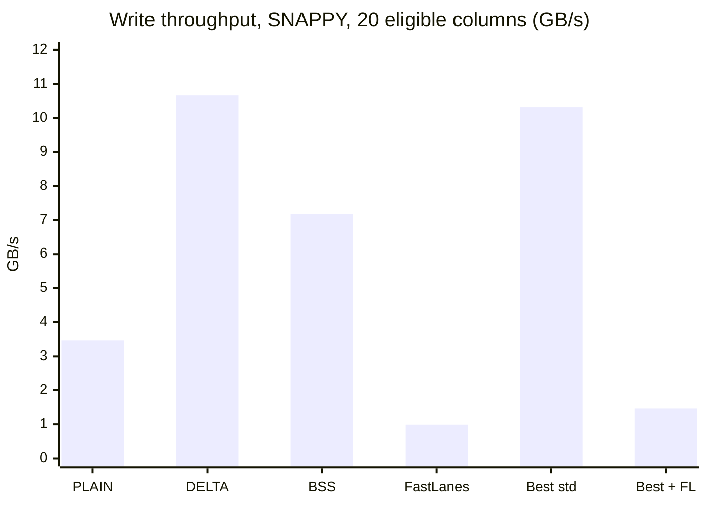
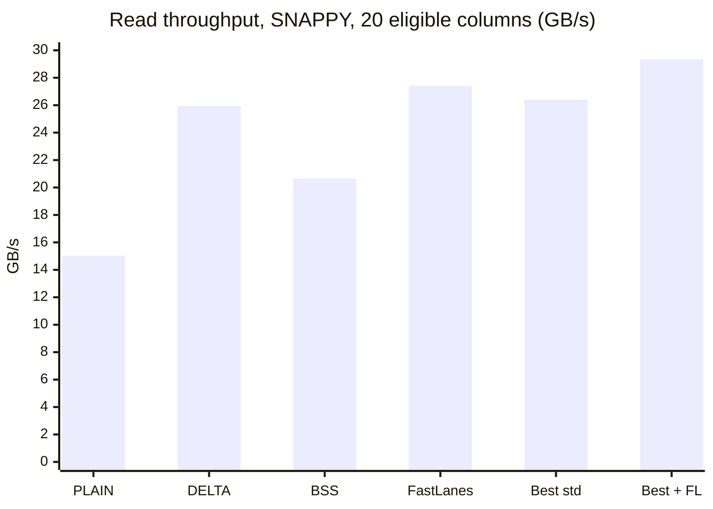

# FastLanes vs standard Parquet encodings on TPC-H SF100 (2026-09-27)

This report measures what FastLanes buys in cuDF's Parquet writer and reader on the full TPC-H
SF100 dataset: file size, write speed and read speed, compared with every standard Parquet
encoding cuDF offers for the same columns. How FastLanes is wired into cuDF is described in
[FASTLANES_INTEGRATION_REPORT_2026-09-27.md](FASTLANES_INTEGRATION_REPORT_2026-09-27.md).

## 1. Summary

- **FastLanes is the smallest encoding for 9 of the 23 eligible columns without compression, 8
  with SNAPPY and 5 with ZSTD.** These are columns whose values spread across a range within each
  page: unsorted foreign keys (`l_partkey`, `l_suppkey`, `o_custkey`), quantities (`ps_availqty`)
  and dates. On them it is 2-7% smaller than the best standard encoding (0-6% with ZSTD).
- **It is much larger on sorted keys, low-cardinality columns and tiny tables.** Both FastLanes
  encoders store `value - page minimum` at one bit width per page, so a sorted key costs 13-17
  bits per value where DELTA_BINARY_PACKED needs 0.03-5. With FastLanes on every eligible column,
  the files are 3-4% larger than with the best standard encodings.
- **Whole files shrink by 1.1% with SNAPPY and 0.6% with ZSTD.** Using FastLanes only where it is
  smallest, the 8 tables go from 27.71 to 27.39 GB (SNAPPY) and from 22.37 to 22.23 GB (ZSTD). The
  gain is diluted because the eligible columns hold only 28-32% of the file bytes; strings and
  decimals hold the rest. Choosing the right standard encoding matters more: it already makes the
  files 4-5% smaller than cuDF's defaults.
- **Writes are 7-12x slower, reads are a little faster.** FastLanes encodes at about 1 GB/s,
  against 6-12 GB/s for DELTA_BINARY_PACKED; the INT32 encoder packs on the CPU and reaches 0.7
  GB/s. It decodes at 22-27 GB/s, 3-19% faster than DELTA_BINARY_PACKED. Rewriting all 8 tables
  takes 76 s instead of 56 s with SNAPPY, and reading them back takes 5.39 s instead of 5.62 s.
- **Page alignment is a small effect.** Pages of exactly 20,480 rows (20 whole FastLanes vectors)
  make FastLanes 2.3% smaller than cuDF's default 20,000-row pages without compression, and at
  most 0.8% smaller with compression. The same columns win under both layouts, apart from two
  near-ties.
- **Every result was checked.** All 345 per-column results and all 22 full-table files that use
  FastLanes decode back to the source values.

## 2. Setup

| Item | Value |
| --- | --- |
| GPU | NVIDIA GeForce RTX 5090 Laptop GPU, 24 GB, compute capability 12.0, driver 595.84 |
| Host | Intel Core Ultra 9 275HX (24 cores), 62 GB RAM, NVMe SSD |
| Software | RAPIDS 26.10 devcontainer (cuda13.3-conda), CUDA 13.3.73, GCC 14.4, nvCOMP 5.3.0.16 |
| cuDF | branch `fastlane-working`: FastLanes on `release/26.10`, library at `9ed93250d2`, tools at `e0f905a0ae`; Release build for sm_120 |
| Data | TPC-H SF100, all 8 tables (61 columns, 866M rows). `lineitem` is the existing `lineitem_sf100.parquet`; the other 7 tables were exported from the existing DuckDB database with `COPY <t> TO '<t>.parquet' (FORMAT parquet, COMPRESSION snappy)`. All use DuckDB's 122,880-row row groups |
| Tools | `fastlanes_encoding_bench` (per-column sweep, read timing), `parquet_io_chunk` (full-table rewrites), driver `tools/bench/run_tpch_sf100_fastlanes_bench.py` |
| Raw results | `cpp/examples/parquet_io/artifacts/fastlanes_bench_sf100_20260927/` (gitignored): `03_raw/*.csv` and logs, `02_machine/summary.json`, `01_human/summary.md` |

### 2.1 Columns FastLanes can encode

23 of the 61 TPC-H columns are eligible:

- **12 INT64 columns** use `FASTLANES_DELTA_BINARY` (the NATIVE64 encoder, GPU): the ten order,
  part, supplier and customer key columns, `l_linenumber` and `ps_availqty`.
- **11 INT32 columns** use `FASTLANE_BITPACK_RAW` (the RAW32 encoder, CPU): the four dates and
  seven small integer columns (`c_nationkey`, `s_nationkey`, `n_nationkey`, `n_regionkey`,
  `r_regionkey`, `o_shippriority`, `p_size`).
- The other 38 columns are strings (29) and `DECIMAL(15,2)` values (9), which FastLanes does not
  support.

By size, the eligible columns are 27.6% of the SNAPPY files and 31.8% of the ZSTD files (with the
best standard encodings). Any saving on them is diluted by that factor at the file level.

### 2.2 Method

- **One layout for every run.** Parquet V2 page headers, 122,880-row row groups and 20,480-row
  pages: exactly 6 pages per row group, each holding 20 whole FastLanes vectors. cuDF builds pages
  and row groups from whole page fragments (5,000 rows by default for fixed-width columns), so
  the writer's `max_page_fragment_size` is set to 20,480 as well; without it the same settings
  give 20,000-row pages and 120,000-row row groups. Only the encoding and the codec vary.
- **Per-column sweep (exhaustive).** Parquet encodes each column chunk independently, so testing
  each column on its own gives the exact best encoding per column. This is the brute-force
  version of the greedy search in [ENCODING_SEARCH_METHOD.md](ENCODING_SEARCH_METHOD.md). For each
  of the 23 columns and each of 5 encodings (PLAIN, DICTIONARY, DELTA_BINARY_PACKED,
  BYTE_STREAM_SPLIT, FastLanes) x 3 codecs (NONE, SNAPPY, ZSTD):
  - the column is loaded onto the GPU once;
  - **write** = cuDF chunked writer from device memory into a host buffer (encode, compression,
    device-to-host copy, footer);
  - **read** = `read_parquet` of that host buffer in 256-row-group batches (host-to-device copy,
    decompression, decode);
  - 1 warm-up + 3 timed runs; medians are reported. Throughput (GB/s) is in-memory column bytes
    (rows x type width) divided by the median time;
  - every result is checked: the decoded column must equal the source, and the footer's page
    encodings must match the request (a silent fallback is flagged and excluded).
- **Full-table plans.** Each table is rewritten with `parquet_io_chunk` under four encoding
  plans, for SNAPPY and ZSTD (NONE is covered by the sweep; an uncompressed `lineitem` would be
  about 66 GB and I/O-bound). Columns FastLanes cannot encode keep cuDF's default in every plan,
  so the plans differ only in the 23 eligible columns:
  - `cudf-default`: cuDF's default encoding for every column;
  - `best-standard`: each eligible column gets its smallest standard encoding from the sweep;
  - `fastlanes-all`: FastLanes on every eligible column;
  - `best-with-fastlanes`: each eligible column gets its smallest encoding, FastLanes included.

  The rewrite time is `parquet_io_chunk`'s processing time: reading the source file, encoding,
  compressing and writing. Plans that use FastLanes are then validated row group by row group
  against the source (not timed). Each output file is read back warm with batched `read_parquet`
  (128 row groups per call; 1 warm-up + 3 timed reads).
- **Page-layout comparison.** The sweep was also run once with cuDF's default fragments (20,000-row
  pages, 120,000-row row groups), which gives the same comparison for all 23 columns under the
  default layout. In addition, `l_partkey` and `l_shipdate` with SNAPPY are measured under three
  layouts: a 614-row page cap on default fragments (what `parquet_io_chunk` requested on these
  files before this change; the pages actually hold 5,000 rows because a page cannot split a
  fragment), cuDF's default layout, and exact 20,480-row pages.

## 3. Results

### 3.1 Compression, column by column

Sizes are in bits per value: file bytes of the column chunk x 8 / rows. PLAIN costs 64.02 bits for
INT64 and 32.02 for INT32 and dates. "Best standard" is the smallest of PLAIN, DICTIONARY,
DELTA_BINARY_PACKED and BYTE_STREAM_SPLIT for that codec; when it differs from the uncompressed
winner it is named in parentheses. The complete matrix is in Appendix A.

**Where FastLanes is smallest** (for at least one codec):

| Column | Type | Rows | FastLanes, NONE | Best standard, NONE | FastLanes vs best: NONE | SNAPPY | ZSTD |
|---|---|---:|---:|---|---:|---:|---:|
| `lineitem.l_partkey` | INT64 | 600M | 25.07 | DELTA 26.05 | **−3.7%** | **−3.7%** | **−1.7%** (BSS) |
| `lineitem.l_suppkey` | INT64 | 600M | 20.07 | DELTA 21.46 | **−6.5%** | **−6.5%** | **−5.9%** |
| `lineitem.l_shipdate` | date | 600M | 12.07 | DELTA 12.47 | **−3.2%** | **−3.2%** | +6.2% (BSS) |
| `lineitem.l_commitdate` | date | 600M | 12.07 | DELTA 12.47 | **−3.2%** | **−3.2%** | +8.5% (BSS) |
| `lineitem.l_receiptdate` | date | 600M | 12.07 | DELTA 12.47 | **−3.2%** | **−3.2%** | +6.0% (BSS) |
| `orders.o_custkey` | INT64 | 150M | 24.07 | DELTA 25.52 | **−5.7%** | **−5.7%** | **−0.0%** (BSS) |
| `orders.o_orderdate` | date | 150M | 12.07 | DICT 12.66 | **−4.7%** | **−4.7%** | **−2.9%** |
| `partsupp.ps_suppkey` | INT64 | 80M | 20.07 | DELTA 20.46 | **−1.9%** | +1,786% | +46,636% |
| `partsupp.ps_availqty` | INT64 | 80M | 14.07 | DELTA 15.09 | **−6.8%** | **−6.8%** | **−4.9%** (BSS) |

On these columns SNAPPY does not shrink FastLanes pages at all and ZSTD removes 0.2-1.3% (8.6% on
`ps_suppkey`); the standard encodings leave more for the codec to find. `o_custkey` with ZSTD is
a tie (24.03 against 24.04 bits). `ps_suppkey` is computed from `ps_partkey` by the TPC-H generator, so its consecutive
differences repeat in a short pattern: SNAPPY and ZSTD collapse the DELTA_BINARY_PACKED stream to
1.06 and 0.04 bits, but cannot see the pattern in FastLanes' packed values.

**Where a standard encoding is always smaller** (bits per value, NONE / SNAPPY / ZSTD):

| Column | Rows | Kind | FastLanes | Best standard | FastLanes vs best, SNAPPY |
|---|---:|---|---|---|---:|
| `lineitem.l_orderkey` | 600M | sorted, 1-7 rows per key | 15.07 / 9.16 / 5.55 | DELTA 5.05 / 2.66 / 1.85 | +244% |
| `orders.o_orderkey` | 150M | sorted | 17.07 / 17.07 / 16.26 | DELTA 5.34 / 0.33 / 0.04 | +5,138% |
| `partsupp.ps_partkey` | 80M | sorted, 4 rows per key | 13.07 / 4.91 / 3.11 | DELTA 1.34 / 0.10 / 0.03 | +4,901% |
| `part.p_partkey` | 20M | sorted, dense | 15.07 / 15.07 / 14.74 | DELTA 0.34 / 0.04 / 0.03 | +37,124% |
| `customer.c_custkey` | 15M | sorted, dense | 15.07 / 15.07 / 14.74 | DELTA 0.34 / 0.04 / 0.03 | +37,091% |
| `supplier.s_suppkey` | 1M | sorted, dense | 15.08 / 15.07 / 14.74 | DELTA 0.34 / 0.04 / 0.03 | +36,484% |
| `lineitem.l_linenumber` | 600M | 7 values | 3.07 / 3.05 / 2.80 | DICT 3.04 / 2.21 / 1.48 | +38% |
| `orders.o_shippriority` | 150M | constant | 1.07 / 0.07 / 0.03 | DICT 0.02 / 0.02 / 0.02 | +243% |
| `part.p_size` | 20M | 50 values | 6.07 / 6.07 / 5.98 | DICT 6.05 / DICT 6.05 / BSS 5.78 | +0.3% |
| `customer.c_nationkey` | 15M | 25 values | 5.07 / 5.07 / 4.98 | DICT 5.04 / DICT 5.04 / BSS 4.81 | +0.4% |
| `supplier.s_nationkey` | 1M | 25 values | 5.07 / 5.07 / 4.98 | DICT 5.05 / DICT 5.05 / BSS 4.81 | +0.4% |
| `nation.n_nationkey` | 25 | tiny table | 304 / 104 / 99 | DELTA 60 / 60 / 60 | +74% |
| `nation.n_regionkey` | 25 | tiny table | 222 / 87 / 83 | DELTA 64 / 64 / 64 | +36% |
| `region.r_regionkey` | 5 | tiny table | 1,112 / 376 / 365 | DELTA 299 / 299 / 299 | +26% |

### 3.2 Why FastLanes wins or loses

- **Frame of reference beats deltas on unsorted values.** Both active FastLanes encoders store
  `value - page minimum` with one bit width per page (integration report, section 2.3), so a page
  costs about log2(max - min + 1) bits per value, rounded up. DELTA_BINARY_PACKED stores the
  differences between neighbouring values; for unsorted values those differences span twice the
  value range, which costs about one more bit per value (a per-miniblock minimum recovers a
  little). That bit is the whole FastLanes advantage: `l_partkey` spans 20 million values (25
  bits) and costs 25.07 bits against 26.05; the dates span about 2,500 days (12 bits) and cost
  12.07 against 12.47.
- **Sorted keys are the opposite case.** Neighbouring values differ by 0 to a few units, so
  DELTA_BINARY_PACKED needs 0.3-5 bits and a codec removes most of the rest, while frame of
  reference still pays for the page's whole range: a 20,480-row page of `o_orderkey` spans about
  82,000 key values (17 bits). The generated FastLanes code in `cpp/src/fastlanes/` includes the
  transpose and running-sum (`unrsum`) kernels that FastLanes uses for true delta coding, but the
  active encoders do not use them (`pre_delta` is off).
- **Low-cardinality columns tie without compression and lose with it.** `l_linenumber` (1-7),
  `p_size` (1-50) and the nation keys (0-24) need as many bits as a dictionary index, so
  uncompressed FastLanes is within 1% of DICTIONARY. With SNAPPY or ZSTD the dictionary indices
  and byte-split streams keep redundancy that the codec removes; FastLanes' packed words keep
  little. A constant column costs a full bit per value because the encoders never pick a 0-bit
  width (`compute_bitwidth` in `cpp/src/fastlanes/encode_common.hpp`): `o_shippriority` costs
  1.07 bits against 0.02 for DICTIONARY.
- **With ZSTD, BYTE_STREAM_SPLIT takes over dates and small integers.** Splitting values into byte
  planes lets ZSTD entropy-code the nearly constant high bytes, which goes below a fixed bit width:
  the dates reach 10.98-11.25 bits against FastLanes' 11.91-11.93.
- **Tiny tables pay fixed costs.** Every FastLanes page carries a 128-byte header and is padded to
  1,024 values, so the 25-row `nation` and 5-row `region` columns are 22-409% larger.

### 3.3 Totals over the eligible columns

Sum over the 20 eligible columns with at least 1M rows (the tiny `nation` and `region` columns are
left out). DICTIONARY is not listed as a fixed choice because cuDF replaced it with
DELTA_BINARY_PACKED on 8 of these columns (section 3.7); it takes part in the per-column choices
wherever it is smallest.

| Encoding | NONE: GB (bits per value) | SNAPPY | ZSTD |
|---|---:|---:|---:|
| PLAIN | 32.37 (50.65) | 16.25 (25.43) | 9.15 (14.32) |
| DELTA_BINARY_PACKED | 8.22 (12.87) | 7.67 (12.01) | 7.41 (11.60) |
| BYTE_STREAM_SPLIT | 32.37 (50.65) | 9.24 (14.46) | 7.25 (11.35) |
| FastLanes | 9.04 (14.15) | 8.50 (13.30) | 8.11 (12.70) |
| Best standard encoding per column | 8.19 (12.81) | 7.64 (11.96) | 7.12 (11.14) |
| Best per column, FastLanes allowed | **7.87** (−3.9%, FastLanes on 9) | **7.33** (−4.1%, FastLanes on 8) | **6.98** (−2.0%, FastLanes on 5) |

Letting each column pick its smallest encoding, with FastLanes allowed, saves 3.9%, 4.1% and 2.0%
of these columns compared with the best standard choice. FastLanes on every column is 10.5%,
11.2% and 14.0% larger than the best standard choice.

### 3.4 Speed

Throughput over the same 20 columns, in GB/s of in-memory column data (sum of bytes / sum of
median times):

| Encoding | Write NONE | Write SNAPPY | Write ZSTD | Read NONE | Read SNAPPY | Read ZSTD |
|---|---:|---:|---:|---:|---:|---:|
| PLAIN | 4.64 | 3.46 | 2.73 | 10.57 | 15.02 | 14.15 |
| DELTA_BINARY_PACKED | 12.26 | 10.66 | 6.10 | 25.74 | 25.95 | 18.83 |
| BYTE_STREAM_SPLIT | 4.71 | 7.18 | 4.85 | 10.16 | 20.66 | 18.96 |
| FastLanes | 1.00 | 0.99 | 0.92 | 26.61 | 27.42 | 22.34 |
| Best standard encoding per column | 11.82 | 10.32 | 5.39 | 26.14 | 26.40 | 20.00 |
| Best per column, FastLanes allowed | 1.46 | 1.47 | 2.11 | 28.58 | 29.34 | 22.45 |





- **Writes.** FastLanes is the slowest encoder by far: 0.9-1.0 GB/s against 6-12 GB/s for
  DELTA_BINARY_PACKED. Per column (Appendix B), the NATIVE64 encoder (INT64, GPU) writes 1.1-1.3
  GB/s and the RAW32 encoder (INT32 and dates, CPU) 0.7-0.8 GB/s. The time goes into the
  per-page staging described in the integration report (section 2.2, step 5): RAW32 copies every
  page to the host, packs it on the CPU and copies it back; NATIVE64 packs on the GPU but still
  runs per-page reductions, allocations and synchronizations. The codec barely matters for
  FastLanes because this stage dominates. Using FastLanes only where it is smallest still cuts
  the write throughput of these columns from 5-12 GB/s to 1.5-2.1 GB/s, because the columns it
  wins on are among the largest.
- **Reads.** FastLanes decodes faster than every standard encoding in aggregate: 3%, 6% and 19%
  faster than DELTA_BINARY_PACKED for NONE, SNAPPY and ZSTD. Per column (SNAPPY, Appendix B) it is
  faster than the best standard encoding on 13 of the 20 columns, including every column where it
  is also smaller
  (for example `l_shipdate` 20.1 against 16.8 GB/s, `o_orderdate` 22.3 against 17.7 GB/s). It is
  slower on five sorted keys, `ps_suppkey` and the constant `o_shippriority`, whose standard pages
  are 3-380x smaller (for example `p_partkey` 31.8 against 96.8 GB/s). Choosing per column with
  FastLanes allowed reads 9-12% faster than the best standard choice.

### 3.5 Whole tables

**File sizes, SNAPPY:**

| Table | cudf-default | best-standard | fastlanes-all | best-with-fastlanes | best-with-fastlanes vs best-standard |
|---|---:|---:|---:|---:|---:|
| lineitem | 18,277.9 MB | 17,226.8 MB | 17,510.2 MB | 16,959.8 MB | −1.5% |
| orders | 4,994.3 MB | 4,994.3 MB | 5,270.8 MB | 4,955.9 MB | −0.8% |
| partsupp | 3,983.0 MB | 3,826.5 MB | 4,054.4 MB | 3,816.3 MB | −0.3% |
| part | 504.7 MB | 504.7 MB | 542.3 MB | 504.7 MB | same file as best-standard |
| customer | 1,086.9 MB | 1,086.9 MB | 1,115.1 MB | 1,086.9 MB | same file as best-standard |
| supplier | 69.0 MB | 69.0 MB | 70.9 MB | 69.0 MB | same file as best-standard |
| nation | 1,875 B | 1,837 B | 2,045 B | 1,837 B | same file as best-standard |
| region | 890 B | 890 B | 937 B | 890 B | same file as best-standard |
| **all 8 tables** | **28.916 GB** | **27.708 GB** | **28.564 GB** | **27.393 GB** | **−1.1%** |

**File sizes, ZSTD:**

| Table | cudf-default | best-standard | fastlanes-all | best-with-fastlanes | best-with-fastlanes vs best-standard |
|---|---:|---:|---:|---:|---:|
| lineitem | 15,580.2 MB | 14,571.6 MB | 14,994.0 MB | 14,445.6 MB | −0.9% |
| orders | 3,796.8 MB | 3,772.2 MB | 4,069.8 MB | 3,765.6 MB | −0.2% |
| partsupp | 2,930.2 MB | 2,843.4 MB | 3,050.0 MB | 2,836.2 MB | −0.3% |
| part | 389.9 MB | 389.4 MB | 426.6 MB | 389.4 MB | same file as best-standard |
| customer | 744.7 MB | 744.3 MB | 772.2 MB | 744.3 MB | same file as best-standard |
| supplier | 47.1 MB | 47.1 MB | 48.9 MB | 47.1 MB | same file as best-standard |
| nation | 1,612 B | 1,574 B | 1,752 B | 1,574 B | same file as best-standard |
| region | 856 B | 856 B | 896 B | 856 B | same file as best-standard |
| **all 8 tables** | **23.489 GB** | **22.368 GB** | **23.362 GB** | **22.228 GB** | **−0.6%** |

- Only `lineitem`, `orders` and `partsupp` gain. In the other tables the eligible columns are a
  sorted primary key and a low-cardinality column, so `best-with-fastlanes` is the
  `best-standard` file.
- `fastlanes-all` is 3.1% (SNAPPY) and 4.4% (ZSTD) larger than `best-standard`, but still 1.2% and
  0.5% smaller than `cudf-default`: cuDF's default dictionary is a poor choice for sorted keys such
  as `l_orderkey`, so `best-standard` is already 4.2% and 4.8% smaller than `cudf-default`.

**Times** (seconds; plans in the order cudf-default / best-standard / best-with-fastlanes /
fastlanes-all):

| Table | Codec | Rewrite | Warm read |
|---|---|---|---|
| lineitem | SNAPPY | 39.0 / 37.4 / 55.4 / 63.3 | 4.69 / 4.50 / 4.27 / 4.43 |
| orders | SNAPPY | 9.4 / 8.7 / 10.2 / 12.3 | 0.53 / 0.55 / 0.54 / 0.52 |
| partsupp | SNAPPY | 7.6 / 7.0 / 7.3 / 8.6 | 0.43 / 0.41 / 0.41 / 0.41 |
| lineitem | ZSTD | 42.9 / 41.0 / 48.8 / 67.4 | 3.48 / 3.37 / 3.24 / 3.08 |
| orders | ZSTD | 8.9 / 8.7 / 10.4 / 12.8 | 0.86 / 0.82 / 0.77 / 0.80 |
| partsupp | ZSTD | 7.0 / 6.8 / 7.2 / 8.5 | 0.74 / 0.71 / 0.75 / 0.75 |
| all 8 tables | SNAPPY | 59.2 / 56.3 / 76.2 / 87.8 | 5.82 / 5.62 / 5.39 / 5.53 |
| all 8 tables | ZSTD | 61.9 / 59.6 / 69.5 / 92.3 | 5.35 / 5.18 / 5.04 / 4.91 |

- The rewrite includes reading the source file, about 15 s for `lineitem` in every plan. FastLanes
  adds 18 s to the `lineitem` rewrite with SNAPPY when used on its five winning columns and 26 s
  on all seven eligible columns, consistent with encoding those 17 GB and 26 GB of column data at
  about 1 GB/s instead of about 10 GB/s.
- Warm reads of the files that use FastLanes are 1.6-8.5% faster for `lineitem` and within noise
  for `orders` and `partsupp` (the three timed reads of each file spread by about 2%). Full-table
  reads run at about 4 GB/s of file bytes, so file size and the string and decimal columns
  dominate them.

### 3.6 Page layout

The sweep was run twice: with cuDF's default page fragments (20,000-row pages in 120,000-row row
groups) and aligned (exactly 20,480-row pages in 122,880-row row groups).

- FastLanes pages get 2.3% smaller without compression on every column: that is the padding from
  20,000 up to 20,480 values. With SNAPPY or ZSTD the change is between −0.8% and +0.1%, because
  the codec already squeezes most of the zero padding; only the constant `o_shippriority`, whose
  pages are almost all header, shrinks by 4-7%.
- PLAIN and DELTA_BINARY_PACKED change by at most 0.01 bits per value and BYTE_STREAM_SPLIT by at
  most 0.06. DICTIONARY moves by up to 0.4 bits per value (`l_orderkey` with ZSTD), because its
  dictionaries now cover 2.4% larger row groups.
- The same columns win under both layouts except two near-ties: `ps_suppkey` without compression
  (FastLanes +0.4% under the default layout, −1.9% aligned) and `o_custkey` with ZSTD (+0.04%
  against −0.02%).

The three-layout comparison, SNAPPY:

| Column | Encoding | Page setting | Rows per page | Bits per value | Write GB/s | Read GB/s |
|---|---|---|---:|---:|---:|---:|
| `lineitem.l_partkey` | FastLanes NATIVE64 | 614-row cap, default fragments | 4,999 | 25.38 | 0.46 | 17.86 |
| `lineitem.l_partkey` | DELTA | 614-row cap, default fragments | 4,999 | 26.22 | 8.28 | 19.76 |
| `lineitem.l_partkey` | FastLanes NATIVE64 | 20,000-row cap, default fragments | 19,981 | 25.27 | 1.07 | 19.97 |
| `lineitem.l_partkey` | DELTA | 20,000-row cap, default fragments | 19,981 | 26.05 | 8.11 | 20.03 |
| `lineitem.l_partkey` | FastLanes NATIVE64 | 20,480 rows, 20,480-row fragments | 20,480 | 25.07 | 1.11 | 21.27 |
| `lineitem.l_partkey` | DELTA | 20,480 rows, 20,480-row fragments | 20,480 | 26.05 | 8.24 | 20.06 |
| `lineitem.l_shipdate` | FastLanes RAW32 | 614-row cap, default fragments | 4,999 | 12.29 | 0.43 | 15.28 |
| `lineitem.l_shipdate` | DELTA | 614-row cap, default fragments | 4,999 | 12.57 | 6.85 | 15.34 |
| `lineitem.l_shipdate` | FastLanes RAW32 | 20,000-row cap, default fragments | 19,981 | 12.17 | 0.66 | 17.48 |
| `lineitem.l_shipdate` | DELTA | 20,000-row cap, default fragments | 19,981 | 12.47 | 6.92 | 16.13 |
| `lineitem.l_shipdate` | FastLanes RAW32 | 20,480 rows, 20,480-row fragments | 20,480 | 12.07 | 0.70 | 20.09 |
| `lineitem.l_shipdate` | DELTA | 20,480 rows, 20,480-row fragments | 20,480 | 12.47 | 7.15 | 16.68 |

FastLanes is 2.2-3.8% smaller than DELTA_BINARY_PACKED in all three layouts. Page size matters
mostly for FastLanes' speed: from 5,000-row to 20,480-row pages its write throughput rises from
0.43-0.46 to 0.70-1.11 GB/s and its read throughput from 15-18 to 20-21 GB/s, while
DELTA_BINARY_PACKED changes by at most 9%. That is the per-page overhead of the FastLanes encode
staging and decode setup.

### 3.7 cuDF silently replaces DICTIONARY on high-cardinality columns

Requesting DICTIONARY does not guarantee dictionary pages. For 10 of the 23 columns the footer
shows DELTA_BINARY_PACKED pages instead: keys whose values are nearly all distinct within a row
group (`l_partkey`, `l_suppkey`, `o_orderkey`, `o_custkey`, `ps_suppkey`, `p_partkey`, `c_custkey`,
`s_suppkey`) and the keys of the 25-row `nation` and 5-row `region` tables. Under the default `dictionary_policy::ADAPTIVE`,
cuDF drops the dictionary for a column chunk when it would not be smaller than PLAIN, would
exceed the 1 MiB default dictionary size, or would need indices wider than 24 bits. It then
writes its non-dictionary default, which with V2 page headers is DELTA_BINARY_PACKED for INT32
and INT64 (PLAIN with V1 headers), without a warning. The benchmark reads the page encodings from
each footer, so those 30 results are marked `n/a` in Appendix A rather than counted as
dictionary results.

### 3.8 Compared with the April 2026 runs

[INT64_SNAPPY_DELTA_VS_FASTLANES_REPORT_2026-04-02.md](INT64_SNAPPY_DELTA_VS_FASTLANES_REPORT_2026-04-02.md)
toggled the four INT64 `lineitem` columns from DELTA_BINARY_PACKED to the older split-32 FastLanes
encoder (now `FASTLANE_BITPACK_SPLIT64`, deprecated) with SNAPPY. It found the same pattern:
`l_partkey` and `l_suppkey` got smaller (−0.6% and −0.9% of the file), `l_orderkey` and
`l_linenumber` larger (+5.1% and +0.5%), and all four together +4.2%. This run reproduces that
with the NATIVE64 encoder on SF100 and extends it to the INT32 and date columns, all 8 tables and
three codecs.

## 4. Caveats

- **Laptop GPU.** Power and thermal limits add run-to-run variance; medians of three runs are
  reported, and differences under about 4% in the full-table read times are not significant.
- **Host buffers are pageable.** Write and read times include device-host copies through pageable
  memory, the same for every encoding.
- **Warm page cache.** Full-table reads come from the OS page cache, not the SSD.
- **nvCOMP ZSTD hang on this GPU.** With the chunked reader's pass limit, cuDF sizes ZSTD scratch
  space through `nvcompBatchedZstdDecompressGetTempSizeSync`, which never returned for some inputs
  on this sm_120 GPU (for example a 25-row `nation` column or the 69 MB `supplier` table). The
  benchmark therefore reads in row-group batches with `read_parquet`, which does not use that
  call. This is an upstream cuDF/nvCOMP issue, independent of FastLanes.
- **RAW32 writes include CPU work.** `FASTLANE_BITPACK_RAW` encodes on the host, so its write
  times depend on the CPU and PCIe more than on the GPU.
- **Recorded commit.** `02_machine/environment.json` records `7bdce30576`: it was captured a minute
  before the tooling commit was amended. The binaries were built from the working tree that was
  then committed unchanged as `e0f905a0ae`.

## 5. Reproducing

Inside the devcontainer, after building libcudf with the RAPIDS wrappers and the examples with
`cpp/examples/build.sh`, with the 8 tables in `cpp/examples/parquet_io/artifacts/tpch100/sf100/`:

```bash
cd cpp/examples/parquet_io
python tools/bench/run_tpch_sf100_fastlanes_bench.py \
  --run-dir artifacts/fastlanes_bench_sf100_20260927 \
  --steps sweep,tables,ablation,summarize
```

The full run took 33 minutes on this machine. The driver resumes an interrupted sweep and
records a hang (for example the nvCOMP issue above) as an error row instead of stalling.

## Appendix A. Bits per value for every encoding

Smallest per row in bold. `n/a`: DICTIONARY was requested but cuDF wrote DELTA_BINARY_PACKED
(section 3.7).

**NONE**

| Column | Type | Rows | PLAIN | DICT | DELTA | BSS | FastLanes |
|---|---|---:|---:|---:|---:|---:|---:|
| `lineitem.l_orderkey` | INT64 | 600M | 64.02 | 23.93 | **5.05** | 64.02 | 15.07 |
| `lineitem.l_partkey` | INT64 | 600M | 64.02 | n/a | 26.05 | 64.02 | **25.07** |
| `lineitem.l_suppkey` | INT64 | 600M | 64.02 | n/a | 21.46 | 64.02 | **20.07** |
| `lineitem.l_linenumber` | INT64 | 600M | 64.02 | **3.04** | 3.34 | 64.02 | 3.07 |
| `lineitem.l_shipdate` | date | 600M | 32.02 | 12.70 | 12.47 | 32.02 | **12.07** |
| `lineitem.l_commitdate` | date | 600M | 32.02 | 12.68 | 12.47 | 32.02 | **12.07** |
| `lineitem.l_receiptdate` | date | 600M | 32.02 | 12.70 | 12.47 | 32.02 | **12.07** |
| `orders.o_orderkey` | INT64 | 150M | 64.02 | n/a | **5.34** | 64.02 | 17.07 |
| `orders.o_custkey` | INT64 | 150M | 64.02 | n/a | 25.52 | 64.02 | **24.07** |
| `orders.o_orderdate` | date | 150M | 32.02 | 12.66 | 12.84 | 32.02 | **12.07** |
| `orders.o_shippriority` | INT32 | 150M | 32.02 | **0.02** | 0.33 | 32.02 | 1.07 |
| `partsupp.ps_partkey` | INT64 | 80M | 64.02 | 22.02 | **1.34** | 64.02 | 13.07 |
| `partsupp.ps_suppkey` | INT64 | 80M | 64.02 | n/a | 20.46 | 64.02 | **20.07** |
| `partsupp.ps_availqty` | INT64 | 80M | 64.02 | 19.25 | 15.09 | 64.02 | **14.07** |
| `part.p_partkey` | INT64 | 20M | 64.02 | n/a | **0.34** | 64.02 | 15.07 |
| `part.p_size` | INT32 | 20M | 32.02 | **6.05** | 7.33 | 32.02 | 6.07 |
| `customer.c_custkey` | INT64 | 15M | 64.02 | n/a | **0.34** | 64.02 | 15.07 |
| `customer.c_nationkey` | INT32 | 15M | 32.02 | **5.04** | 6.33 | 32.02 | 5.07 |
| `supplier.s_suppkey` | INT64 | 1M | 64.02 | n/a | **0.34** | 64.02 | 15.08 |
| `supplier.s_nationkey` | INT32 | 1M | 32.02 | **5.05** | 6.33 | 32.02 | 5.07 |
| `nation.n_nationkey` | INT32 | 25 | 90.56 | n/a | **59.84** | 90.56 | 304.32 |
| `nation.n_regionkey` | INT32 | 25 | 90.56 | 76.16 | **63.68** | 90.56 | 222.40 |
| `region.r_regionkey` | INT32 | 5 | 315.20 | n/a | **299.20** | 315.20 | 1,112.00 |

**SNAPPY**

| Column | Type | Rows | PLAIN | DICT | DELTA | BSS | FastLanes |
|---|---|---:|---:|---:|---:|---:|---:|
| `lineitem.l_orderkey` | INT64 | 600M | 12.48 | 16.01 | **2.66** | 7.50 | 9.16 |
| `lineitem.l_partkey` | INT64 | 600M | 43.68 | n/a | 26.05 | 28.19 | **25.07** |
| `lineitem.l_suppkey` | INT64 | 600M | 39.52 | n/a | 21.46 | 25.84 | **20.07** |
| `lineitem.l_linenumber` | INT64 | 600M | 7.20 | **2.21** | 2.46 | 5.41 | 3.05 |
| `lineitem.l_shipdate` | date | 600M | 25.15 | 12.70 | 12.47 | 13.20 | **12.07** |
| `lineitem.l_commitdate` | date | 600M | 24.84 | 12.68 | 12.47 | 12.87 | **12.07** |
| `lineitem.l_receiptdate` | date | 600M | 25.17 | 12.70 | 12.47 | 13.23 | **12.07** |
| `orders.o_orderkey` | INT64 | 150M | 31.91 | n/a | **0.33** | 3.30 | 17.07 |
| `orders.o_custkey` | INT64 | 150M | 42.86 | n/a | 25.52 | 26.08 | **24.07** |
| `orders.o_orderdate` | date | 150M | 26.27 | 12.66 | 12.84 | 15.98 | **12.07** |
| `orders.o_shippriority` | INT32 | 150M | 1.52 | **0.02** | 0.04 | 1.52 | 0.07 |
| `partsupp.ps_partkey` | INT64 | 80M | 14.04 | 14.08 | **0.10** | 9.32 | 4.91 |
| `partsupp.ps_suppkey` | INT64 | 80M | 32.06 | n/a | **1.06** | 5.09 | 20.07 |
| `partsupp.ps_availqty` | INT64 | 80M | 30.08 | 16.76 | 15.09 | 18.39 | **14.07** |
| `part.p_partkey` | INT64 | 20M | 32.03 | n/a | **0.04** | 5.37 | 15.07 |
| `part.p_size` | INT32 | 20M | 15.73 | **6.05** | 7.29 | 9.21 | 6.07 |
| `customer.c_custkey` | INT64 | 15M | 32.03 | n/a | **0.04** | 5.37 | 15.07 |
| `customer.c_nationkey` | INT32 | 15M | 15.41 | **5.04** | 6.28 | 9.17 | 5.07 |
| `supplier.s_suppkey` | INT64 | 1M | 32.03 | n/a | **0.04** | 5.38 | 15.07 |
| `supplier.s_nationkey` | INT32 | 1M | 15.41 | **5.05** | 6.28 | 9.17 | 5.07 |
| `nation.n_nationkey` | INT32 | 25 | 90.56 | n/a | **59.84** | 68.16 | 104.32 |
| `nation.n_regionkey` | INT32 | 25 | 74.56 | 76.16 | **63.68** | 68.16 | 86.72 |
| `region.r_regionkey` | INT32 | 5 | 315.20 | n/a | **299.20** | 300.80 | 376.00 |

**ZSTD**

| Column | Type | Rows | PLAIN | DICT | DELTA | BSS | FastLanes |
|---|---|---:|---:|---:|---:|---:|---:|
| `lineitem.l_orderkey` | INT64 | 600M | 2.66 | 11.34 | **1.85** | 2.49 | 5.55 |
| `lineitem.l_partkey` | INT64 | 600M | 28.08 | n/a | 25.97 | 25.45 | **25.03** |
| `lineitem.l_suppkey` | INT64 | 600M | 23.92 | n/a | 21.29 | 21.98 | **20.03** |
| `lineitem.l_linenumber` | INT64 | 600M | 3.63 | **1.48** | 1.63 | 1.63 | 2.80 |
| `lineitem.l_shipdate` | date | 600M | 15.77 | 12.31 | 12.05 | **11.23** | 11.92 |
| `lineitem.l_commitdate` | date | 600M | 15.54 | 12.28 | 12.03 | **10.98** | 11.91 |
| `lineitem.l_receiptdate` | date | 600M | 15.79 | 12.31 | 12.05 | **11.25** | 11.93 |
| `orders.o_orderkey` | INT64 | 150M | 7.25 | n/a | **0.04** | 0.25 | 16.26 |
| `orders.o_custkey` | INT64 | 150M | 25.08 | n/a | 25.35 | 24.04 | **24.03** |
| `orders.o_orderdate` | date | 150M | 16.22 | 12.26 | 12.78 | 12.74 | **11.91** |
| `orders.o_shippriority` | INT32 | 150M | 0.03 | **0.02** | 0.03 | 0.03 | 0.03 |
| `partsupp.ps_partkey` | INT64 | 80M | 2.08 | 8.10 | **0.03** | 0.47 | 3.11 |
| `partsupp.ps_suppkey` | INT64 | 80M | 8.19 | n/a | **0.04** | 0.52 | 18.34 |
| `partsupp.ps_availqty` | INT64 | 80M | 15.90 | 15.35 | 15.00 | 14.72 | **14.00** |
| `part.p_partkey` | INT64 | 20M | 8.34 | n/a | **0.03** | 0.21 | 14.74 |
| `part.p_size` | INT32 | 20M | 8.33 | 6.00 | 7.11 | **5.78** | 5.98 |
| `customer.c_custkey` | INT64 | 15M | 8.34 | n/a | **0.03** | 0.21 | 14.74 |
| `customer.c_nationkey` | INT32 | 15M | 7.55 | 5.00 | 5.96 | **4.81** | 4.98 |
| `supplier.s_suppkey` | INT64 | 1M | 8.35 | n/a | **0.03** | 0.21 | 14.74 |
| `supplier.s_nationkey` | INT32 | 1M | 7.55 | 5.00 | 5.96 | **4.81** | 4.98 |
| `nation.n_nationkey` | INT32 | 25 | 76.48 | n/a | **59.84** | 71.36 | 98.88 |
| `nation.n_regionkey` | INT32 | 25 | 74.88 | 76.16 | **63.68** | 71.36 | 82.56 |
| `region.r_regionkey` | INT32 | 5 | 315.20 | n/a | **299.20** | 315.20 | 364.80 |

## Appendix B. Speed per column, SNAPPY

GB/s of in-memory column data; "best standard" is the smallest standard encoding for the column.

| Column | FastLanes encoder | FastLanes write | Best standard write | FastLanes read | Best standard read |
|---|---|---:|---:|---:|---:|
| `lineitem.l_orderkey` | NATIVE64 (GPU) | 1.13 | 17.26 (DELTA) | 35.00 | 49.37 |
| `lineitem.l_partkey` | NATIVE64 (GPU) | 1.11 | 8.30 (DELTA) | 21.98 | 20.65 |
| `lineitem.l_suppkey` | NATIVE64 (GPU) | 1.13 | 9.29 (DELTA) | 24.90 | 22.90 |
| `lineitem.l_linenumber` | NATIVE64 (GPU) | 1.23 | 16.85 (DICT) | 63.80 | 58.23 |
| `lineitem.l_shipdate` | RAW32 (CPU) | 0.70 | 7.11 (DELTA) | 20.07 | 16.81 |
| `lineitem.l_commitdate` | RAW32 (CPU) | 0.70 | 7.01 (DELTA) | 20.06 | 16.14 |
| `lineitem.l_receiptdate` | RAW32 (CPU) | 0.70 | 7.01 (DELTA) | 19.52 | 15.85 |
| `orders.o_orderkey` | NATIVE64 (GPU) | 1.17 | 31.98 (DELTA) | 30.70 | 70.87 |
| `orders.o_custkey` | NATIVE64 (GPU) | 1.12 | 8.58 (DELTA) | 24.02 | 22.77 |
| `orders.o_orderdate` | RAW32 (CPU) | 0.71 | 5.57 (DICT) | 22.27 | 17.66 |
| `orders.o_shippriority` | RAW32 (CPU) | 0.77 | 12.82 (DICT) | 61.48 | 67.85 |
| `partsupp.ps_partkey` | NATIVE64 (GPU) | 1.22 | 35.66 (DELTA) | 51.88 | 75.55 |
| `partsupp.ps_suppkey` | NATIVE64 (GPU) | 1.15 | 24.10 (DELTA) | 27.97 | 64.92 |
| `partsupp.ps_availqty` | NATIVE64 (GPU) | 1.19 | 12.70 (DELTA) | 34.73 | 32.67 |
| `part.p_partkey` | NATIVE64 (GPU) | 1.19 | 36.64 (DELTA) | 31.83 | 96.80 |
| `part.p_size` | RAW32 (CPU) | 0.80 | 8.30 (DICT) | 32.13 | 25.76 |
| `customer.c_custkey` | NATIVE64 (GPU) | 1.23 | 33.14 (DELTA) | 32.14 | 81.87 |
| `customer.c_nationkey` | RAW32 (CPU) | 0.76 | 8.28 (DICT) | 31.31 | 29.05 |
| `supplier.s_suppkey` | NATIVE64 (GPU) | 1.34 | 9.98 (DELTA) | 8.68 | 6.71 |
| `supplier.s_nationkey` | RAW32 (CPU) | 0.83 | 2.84 (DICT) | 5.69 | 5.41 |
